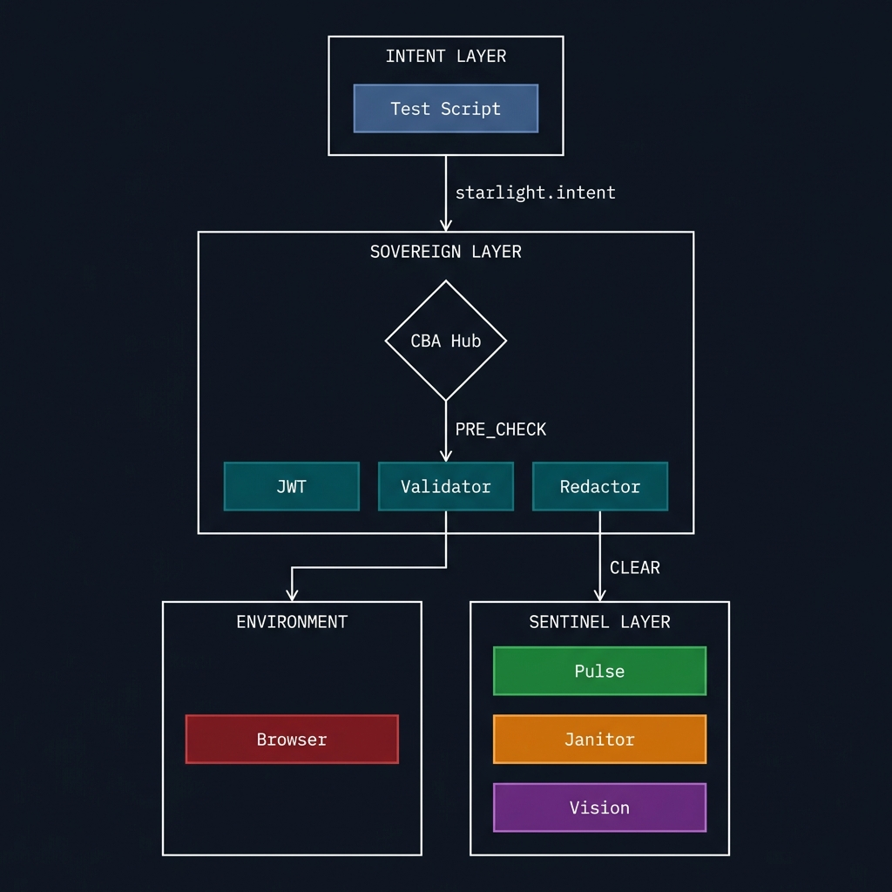
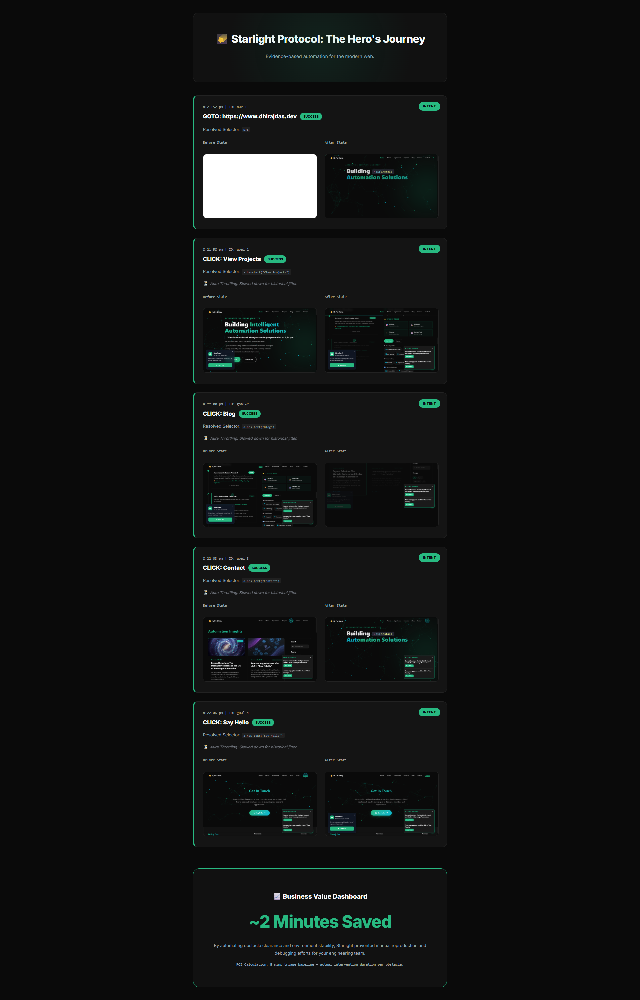

# 🛰️ Constellation-Based Automation (CBA)
## Starlight Protocol v3.0.2 — The Autonomous Era

[](CHANGELOG.md)
[](LICENSE)
[](https://github.com/godhiraj-code/cba/actions/workflows/starlight_ci.yml)
[](https://nodejs.org)
[](https://python.org)

**"Don't look at the ground; look at the Starlight."**

CBA is a philosophical shift in browser automation. Inspired by biological navigation (like the dung beetle using the Milky Way), this framework moves away from linear scripts that handle every possible UI obstacle. Instead, it uses a **Sovereign Constellation** of autonomous agents (Sentinels) that orient toward high-level goals.

---

## 🏗️ The Sovereign Constellation



CBA uses a **Decentralized Sidecar Architecture** communicating over a JSON-RPC message bus.

| Layer | Role |
| :--- | :--- |
| **Intent Layer** | High-level business intent. Selector-less (e.g., `{ goal: 'Login' }`). |
| **The Hub** | Orchestrates Playwright, resolves semantic goals, manages **Sovereign Context**. |
| **Vision Sentinel** | Uses local SLMs (Moondream) for visual obstacle detection. |
| **Janitor Sentinel** | Heuristic background process that clears modals and overlays. |
| **Pulse Sentinel** | Monitors network/DOM jitter for **Wait-Less** temporal stability. |
| **Data Sentinel** | Passively extracts metadata and injects it into the shared context. |
| **PII Sentinel** | Detects and alerts on sensitive data exposure. |

---

### 🌌 Phase 16: The Autonomous Era (World-Class Recorder)

| Feature | Description |
|---------|-------------|
| **Mutation Fingerprinting** | Captures page "stability signatures" during recording |
| **Autonomous CLI** | `bin/starlight.js` for zero-touch mission execution |
| **Context-Aware Pulse** | Dynamic settle-time adjustment based on stability hints |
| **Failure-Safe Reports** | Immediate "Hero Story" generation on mission error |

### � Phase 10: Enterprise Observability (NEW in v3.0.2)

| Feature | Description |
|---------|-------------|
| **Webhook Alerts** | Slack/Teams/Discord notifications on mission completion |
| **Real-Time Dashboard** | Live telemetry in Mission Control |
| **MTTR Tracking** | Mean Time To Recovery metrics |

**Quick Webhook Setup:**
```json
// config.json
"webhooks": {
    "enabled": true,
    "urls": ["https://hooks.slack.com/services/XXX"],
    "notifyOn": ["failure", "success"]
}
```

### �🛡️ Phase 9: Sovereign Security & Compliance

| Feature | Description |
|---------|-------------|
| **Shadow DOM Penetration** | Deep-piercing `>>>` selectors for web components |
| **PII Sentinel** | Privacy-first sensitive data detection |
| **Traffic Sovereign** | Network blocking & chaos engineering |
| **Shadow-Aware Janitor** | Clears obstacles inside shadow roots |

### 🔮 Shadow DOM Support

```javascript
// CBA automatically pierces shadow boundaries
{ goal: 'ESCAPE SHADOW' }  // Finds button inside <shadow-modal>
```

See [CHANGELOG.md](CHANGELOG.md) for full history.

---

## 🛰️ The Starlight Protocol

Standardized signals for zero-wait, selector-less autonomy:

| Method | Purpose |
| :--- | :--- |
| `starlight.intent` | Issues a high-level `goal` or `cmd`. |
| `starlight.pre_check` | Handshake broadcast with screenshot for AI analysis. |
| `starlight.wait` | Veto due to environmental instability. |
| `starlight.hijack` | Request absolute browser lock for healing. |
| `starlight.context_update` | Inject intelligence into the shared mission state. |

---

## 🛠️ The Starlight SDK (Python)

Build a sentinel in minutes:

```python
from sdk.starlight_sdk import SentinelBase

class MySentinel(SentinelBase):
    def __init__(self):
        super().__init__(layer_name="MySentinel", priority=10)
        self.capabilities = ["custom-healing"]

    async def on_pre_check(self, params, msg_id):
        # Your custom healing logic here
        await self.send_clear()

if __name__ == "__main__":
    import asyncio
    asyncio.run(MySentinel().start())
```

**SDK Features:**
- ✅ Auto-reconnect on connection failure
- ✅ Persistent memory (JSON-based)
- ✅ Graceful shutdown (SIGINT/SIGTERM)
- ✅ Atomic file writes
- ✅ Config-driven settings

---

## 🌌 Phase 7: The Galaxy Mesh

CBA is a **Self-Learning Ecosystem** that gets smarter with every mission:

### 🧠 Self-Healing Selectors
When a selector fails, CBA automatically tries alternatives from memory:

```
Mission 1: Goal "Login" → #login-btn → SUCCESS ✓
           (Learned and saved to memory)
           
Mission 2: Goal "Login" → #login-btn (changed to .new-login!)
           FAIL → Hub checks historical memory
           Tries #login-btn from memory → SUCCESS ✓
           Report shows "SELF-HEALED" badge
```

### ⏱️ Animation Tolerance (v2.8)
For animated sites, CBA force-proceeds after 3 stability checks:
- **PulseSentinel** detects DOM mutations from animations
- After 3 vetoes, Hub uses "Animation Tolerance" to continue
- No more infinite blocking from CSS animations!

### 🔮 Aura Throttling
CBA learns when your site is historically unstable:
- Tracks 500ms "entropy buckets" from past runs
- Proactively slows down during known jitter windows
- Prevents flakiness before it happens

### 📈 ROI Dashboard
The `report.html` quantifies business value:
- **Triage Savings**: Minutes saved per obstacle cleared
- **Self-Healing Credits**: Automated selector fixes
- **Aura Stabilization**: Predictive jitter avoidance
- **Visual Proof**: Before/after screenshots



---

## ⚖️ Sovereignty vs. Simplicity

Starlight is an Enterprise-grade engine designed for high-stakes, dynamic environments. It is important to understand the trade-offs:

| ✅ Good For | ❌ Not Recommended For |
| :--- | :--- |
| **Noisy UIs**: Sites with frequent popups, banners, and modals. | **Stable UIs**: Simple, static sites where a CSS selector never changes. |
| **Enterprise CI/CD**: High-frequency runs where stability ROI is paramount. | **Small Projects**: One-off scripts or hobby projects. |
| **Context-Aware Quality**: When you need tests that "understand" page stability. | **Resource-Constrained**: Low-RAM environments (running AI agents has overhead). |

> [!IMPORTANT]
> **The Starlight Paradigm Shift**: You are moving from *maintaining fragile scripts* to *managing a fleet of intelligent agents*. While the "up-front" setup is higher, the long-term ROI in reduced triaging and refactoring is what defines the "Autonomous Era."

---

## 🎮 GUI Launcher (Mission Control)

A visual control panel for starting Hub, Sentinels, and running missions:

```bash
# Start the launcher
node launcher/server.js

# Open in browser
http://localhost:3000
```

**Features:**
- 🟢 Status indicators for Hub, PulseSentinel, JanitorSentinel
- ▶️ Start All / Stop All buttons
- 🚀 Mission dropdown with Launch button
- 📋 Live logs console with real-time output
- 📊 Quick link to view report
- 🔴 **No-Code Recorder**: Record test scripts by clicking through your site

### 🎬 No-Code Recorder (NEW in v3.0.1)
1. Enter a URL and click `🔴 Record`
2. A floating **Starlight HUD** appears in the browser
3. Interact with the site - all clicks and inputs are captured
4. Use `🏷️ Tag` to name important clicks, `🚩 Checkpoint` to mark milestones
5. Click `⏹️ Stop` to generate an intent file automatically


---

## 🚀 Getting Started

### Prerequisites
- Node.js v18+ & Python 3.9+
- [Ollama](https://ollama.ai/) (optional, for Vision Sentinel)

### Setup
```bash
git clone <repo-url>
cd cba
npm install
pip install -r requirements.txt
npx playwright install chromium
```

### Run the Demo (The Autonomous Way)
```bash
# Start a mission with one command (Hub + Sentinels + Intent)
node bin/starlight.js test/intent_portfolio_v2.js --headless --verbose
```

### Manual Mode (Development)
```bash
# Terminal 1: Hub
node src/hub.js

# Terminal 2: Sentinels
python sentinels/pulse_sentinel.py
python sentinels/janitor.py

# Terminal 3: Mission
node test/intent_portfolio_v2.js
```

---

## ⚙️ Configuration

All settings are in `config.json`:

```json
{
    "hub": {
        "port": 8080,
        "syncBudget": 30000,
        "missionTimeout": 180000,
        "shadowDom": {
            "enabled": true,
            "maxDepth": 5
        }
    },
    "sentinel": {
        "settlementWindow": 1.0,
        "reconnectDelay": 3
    },
    "vision": {
        "model": "moondream",
        "timeout": 25
    }
}
```

See [technical_guide.md](technical_guide.md) for full reference.

---

## 📚 Documentation

| Document | Description |
|----------|-------------|
| [user_guide.md](user_guide.md) | Getting started, sentinel overview |
| [technical_guide.md](technical_guide.md) | Protocol spec, SDK reference, Shadow DOM |
| [CHANGELOG.md](CHANGELOG.md) | Version history |
| [STARLIGHT_STANDARD.md](STARLIGHT_STANDARD.md) | Formal protocol specification |
| [roadmap.md](roadmap.md) | Future development plans |

---

## 🐳 Docker Deployment

```bash
docker-compose up --build
```

Deploys a managed Hub and sentinel mesh for ephemeral CI/CD execution.

---

## 📚 The Sovereign Automation Series

Follow the journey of the Starlight Protocol:
- **[Part 1: The Inner Workings](latest_blog.md)**: Deep dive into Sentinels and the Hub.
- **[Part 2: Watching the Constellation](latest_blog_part2.md)**: Exploring Mission Control and ROI reporting.
- **[Part 3: The Autonomous Era](latest_blog_part3.md)**: v3.0 release, Mutation Fingerprinting, and CLI Orchestration.

---

## 🗺️ Roadmap

| Phase | Status |
|-------|--------|
| Phase 1-6 | ✅ Complete |
| Phase 7 (Galaxy Mesh) | ✅ Complete |
| Phase 8 (Quality) | ✅ Complete |
| Phase 9 (Security) | ✅ Complete |
| Phase 10 (Observability) | 🔜 Coming Soon |

---

## 📄 License

MIT License - see [LICENSE](LICENSE)

---

*Built with ❤️ by [Dhiraj Das](https://www.dhirajdas.dev)*
