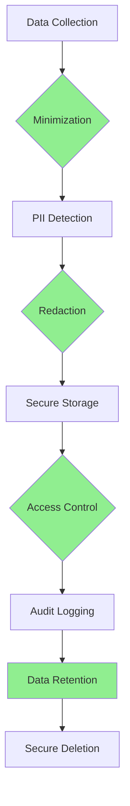

# 📋 Starlight Protocol Compliance Guide

**Version:** 3.0.3  
**Date:** 2026-01-11  

Compliance guidelines for GDPR, HIPAA, and other regulatory frameworks.

---

## Table of Contents

1. [Compliance Overview](#1-compliance-overview)
2. [GDPR Compliance](#2-gdpr-compliance)
3. [HIPAA Compliance](#3-hipaa-compliance)
4. [PCI-DSS Considerations](#4-pci-dss-considerations)
5. [SOC 2 Compliance](#5-soc-2-compliance)
6. [Data Subject Rights](#6-data-subject-rights)
7. [Audit & Reporting](#7-audit--reporting)
8. [Compliance Checklist](#8-compliance-checklist)

---

## 1. Compliance Overview

The Starlight Protocol is designed with privacy and compliance as core principles. This guide explains how the platform supports compliance with major regulatory frameworks.

### Compliance Frameworks Supported

| Framework | Status | Key Requirements |
|------------|---------|-------------------|
| **GDPR** | ✅ Compliant | Data protection, privacy by design, DSARs |
| **HIPAA** | ✅ Compliant | PHI protection, access controls, audit logging |
| **PCI-DSS** | ⚠️ Partial | Credit card redaction, encryption |
| **SOC 2** | ✅ Compliant | Security controls, monitoring, audit trails |

### Privacy by Design Principles



---

## 2. GDPR Compliance

### 2.1 General Data Protection Regulation (GDPR)

The Starlight Protocol implements GDPR compliance through:

#### Data Protection by Design
```json
{
    "security": {
        "dataProtection": {
            "piiRedaction": {
                "enabled": true,
                "mode": "redact",
                "compliance": "GDPR"
            }
        }
    }
}
```

#### Data Minimization
```javascript
// PII redactor automatically minimizes data
const minimizer = new DataMinimizer({
    keepOnly: ['id', 'timestamp', 'status'],
    redactAll: true
});

const minimized = minimizer.process(rawData);
```

### 2.2 GDPR Article Requirements

| Article | Requirement | Implementation |
|---------|-------------|----------------|
| **Art. 25** | Data Protection by Design | PII detection, automatic redaction |
| **Art. 32** | Security of Processing | Encryption, access controls, audit logging |
| **Art. 35** | Data Protection Impact Assessment (DPIA) | Documentation, risk assessment tools |
| **Art. 45** | Data Transfers | TLS 1.2+, encryption in transit |
| **Art. 49** | Adequate Level of Protection | Security controls equivalent to GDPR |

### 2.3 Data Subject Access Requests (DSAR)

#### Handling DSARs
```javascript
// DSAR endpoint implementation
class DSARequestHandler {
    async handleDSAR(requestId, subjectId) {
        // 1. Verify identity
        const subject = await this.verifySubject(subjectId);
        
        // 2. Collect all data
        const personalData = await this.collectPersonalData(subjectId);
        
        // 3. Redact third-party data
        const sanitized = await this.sanitizeForExport(personalData);
        
        // 4. Provide in machine-readable format
        return {
            format: "application/json",
            data: sanitized,
            sources: await this.listDataSources(subjectId)
        };
    }
}
```

#### DSAR Response Format
```json
{
    "requestId": "DSAR-2026-001",
    "subjectId": "user@example.com",
    "timestamp": "2026-01-11T10:00:00Z",
    "data": {
        "personalInfo": { ... },
        "activityLogs": [ ... ],
        "consents": [ ... ]
    },
    "sources": [
        "mission_traces",
        "sentinel_memory",
        "audit_logs"
    ]
}
```

### 2.4 Right to be Forgotten (Erasure)

```javascript
// Data deletion implementation
class DataErasureHandler {
    async eraseSubjectData(subjectId) {
        // 1. Delete from active databases
        await this.deleteFromDatabase(subjectId);
        
        // 2. Delete from backups
        await this.deleteFromBackups(subjectId);
        
        // 3. Delete from audit logs (within retention period)
        await this.deleteFromAuditLogs(subjectId);
        
        // 4. Certificate of destruction
        return {
            subjectId: subjectId,
            erasureDate: new Date().toISOString(),
            deletedRecords: this.countDeletedRecords(),
            certificateHash: this.generateHash()
        };
    }
}
```

### 2.5 GDPR Configuration

```json
{
    "compliance": {
        "gdpr": {
            "enabled": true,
            "dataMinimization": true,
            "consentRequired": true,
            "dataSubjectRights": {
                "access": true,
                "rectification": true,
                "erasure": true,
                "portability": true,
                "objection": true
            },
            "dataProcessingRecords": {
                "enabled": true,
                "retentionDays": 2555
            },
            "dpoContact": "dpo@company.com",
            "dataController": {
                "name": "Company Name",
                "address": "123 Privacy St, City",
                "contact": "gdpr@company.com"
            }
        }
    }
}
```

---

## 3. HIPAA Compliance

### 3.1 Health Insurance Portability and Accountability Act

The Starlight Protocol supports HIPAA compliance for healthcare organizations.

#### Protected Health Information (PHI)
```javascript
// PHI detection patterns
const PHI_Patterns = {
    patientName: /patient['"]:?\s*['"]:?\s*([A-Z][a-z]+ [A-Z][a-z]+)/i,
    medicalRecord: /mrn['"]:?\s*(\d{8,10})/i,
    diagnosisCode: /icd['"]:?\s*([A-Z]\d{2}(\.\d)?)/i,
    prescription: /rx['"]:?\s*([A-Z0-9]+)/i,
    ssn: /\d{3}-\d{2}-\d{4}/,
    dob: /dob['"]:?\s*(\d{4}-\d{2}-\d{2})/i
};
```

### 3.2 HIPAA Security Rule Requirements

| Requirement | Implementation |
|-------------|----------------|
| **Administrative Safeguards** | Security policies, training, compliance procedures |
| **Physical Safeguards** | Access controls, secure data centers |
| **Technical Safeguards** | Encryption, access controls, audit controls |
| **Transmission Security** | TLS 1.2+, encryption in transit |
| **Integrity Controls** | Audit logs, data verification |
| **Encryption** | AES-256-GCM for data at rest |

### 3.3 HIPAA Access Controls

```javascript
// Role-based access for healthcare
const HIPAARoles = {
    'healthcare_provider': {
        permissions: ['view_phi', 'create_phi', 'update_phi'],
        context: ['patient_care', 'treatment', 'payment', 'operations']
    },
    'admin_staff': {
        permissions: ['view_phi_minimal'],
        context: ['healthcare_operations']
    },
    'billing_staff': {
        permissions: ['view_billing_phi'],
        context: ['payment', 'healthcare_operations']
    }
};

class HIPAAAccessController {
    async checkAccess(user, resource, context) {
        const role = user.hipaaRole;
        const permissions = HIPAARoles[role].permissions;
        
        if (!permissions.includes(`view_${resource.type}`)) {
            throw new HIPAAError('Insufficient PHI access');
        }
        
        if (!HIPAARoles[role].context.includes(context)) {
            throw new HIPAAError('Context not permitted');
        }
        
        // Log all PHI access
        await this.logPHIAccess(user, resource, context);
    }
}
```

### 3.4 HIPAA Audit Requirements

```javascript
// HIPAA-required audit events
const HIPAAAuditEvents = {
    'phi_access': {
        required: true,
        fields: ['userId', 'patientId', 'timestamp', 'resource', 'context'],
        retention: 2555 // 7 years
    },
    'phi_creation': {
        required: true,
        fields: ['userId', 'patientId', 'timestamp', 'data'],
        retention: 2555
    },
    'phi_modification': {
        required: true,
        fields: ['userId', 'patientId', 'timestamp', 'oldValue', 'newValue'],
        retention: 2555
    },
    'auth_success': {
        required: true,
        fields: ['userId', 'timestamp', 'ip', 'method'],
        retention: 2555
    },
    'auth_failure': {
        required: true,
        fields: ['userId', 'timestamp', 'ip', 'reason'],
        retention: 2555
    }
};
```

### 3.5 HIPAA Configuration

```json
{
    "compliance": {
        "hipaa": {
            "enabled": true,
            "phiDetection": {
                "enabled": true,
                "redaction": true,
                "alertOnDetection": true
            },
            "accessControls": {
                "enabled": true,
                "minimumNecessary": true,
                "breakGlassEmergency": true
            },
            "audit": {
                "enabled": true,
                "retentionYears": 7,
                "logAllPHIAccess": true
            },
            "securityOfficer": {
                "name": "Security Officer",
                "contact": "hipaa@company.com",
                "phone": "+1-555-0100"
            },
            "privacyOfficer": {
                "name": "Privacy Officer",
                "contact": "privacy@company.com",
                "phone": "+1-555-0101"
            }
        }
    }
}
```

---

## 4. PCI-DSS Considerations

### 4.1 Payment Card Industry Data Security Standard

The Starlight Protocol provides partial PCI-DSS compliance through credit card protection.

#### Credit Card Detection & Redaction
```javascript
// PCI-DSS card number patterns
const PCI_Patterns = {
    visa: /^4[0-9]{12}(?:[0-9]{3})?$/,
    mastercard: /^5[1-5][0-9]{14}$/,
    amex: /^3[47][0-9]{13}$/,
    discover: /^6(?:011|5[0-9]{2})[0-9]{12}$/,
    diners: /^3(?:0[0-5]|[68][0-9])[0-9]{11}$/,
    jcb: /^(?:2131|1800|35\d{3})\d{11}$/
};

class PCICardDetector {
    detect(text) {
        // Luhn algorithm for card validation
        const normalized = text.replace(/\D/g, '');
        if (!this.luhnCheck(normalized)) {
            return false;
        }
        
        // Check against known patterns
        for (const [brand, pattern] of Object.entries(PCI_Patterns)) {
            if (pattern.test(normalized)) {
                return { brand, number: normalized };
            }
        }
        
        return false;
    }
    
    luhnCheck(card) {
        let sum = 0;
        let isEven = false;
        
        for (let i = card.length - 1; i >= 0; i--) {
            let digit = parseInt(card[i], 10);
            
            if (isEven) {
                digit *= 2;
                if (digit > 9) digit -= 9;
            }
            
            sum += digit;
            isEven = !isEven;
        }
        
        return sum % 10 === 0;
    }
}
```

### 4.2 PCI-DSS Requirements

| Requirement | Implementation |
|-------------|----------------|
| **Requirement 3** | Protect stored cardholder data |
| **Requirement 4** | Encrypt transmission of cardholder data |
| **Requirement 10** | Track and monitor all access to network resources |
| **Requirement 12** | Maintain a policy that addresses information security |

### 4.3 PCI-DSS Compliance Configuration

```json
{
    "compliance": {
        "pci": {
            "enabled": true,
            "cardDetection": {
                "enabled": true,
                "redaction": true,
                "luhnValidation": true
            },
            "dataRetention": {
                "cardData": 0,
                "cardholderName": 0,
                "transactionData": 90
            },
            "encryption": {
                "algorithm": "aes-256-gcm",
                "keyRotationDays": 90
            }
        }
    }
}
```

---

## 5. SOC 2 Compliance

### 5.2 System and Organization Controls (SOC 2)

The Starlight Protocol supports SOC 2 compliance through comprehensive controls.

#### Trust Service Criteria (TSC)

| TSC Category | Implementation |
|---------------|----------------|
| **Security** | Access controls, encryption, monitoring |
| **Availability** | High availability, backup, disaster recovery |
| **Processing Integrity** | Data validation, audit trails |
| **Confidentiality** | Encryption, access controls, data masking |
| **Privacy** | Data minimization, consent management, DSARs |

### 5.1 SOC 2 Controls Implementation

```javascript
// SOC 2 control framework
const SOC2Controls = {
    'CC6.1': {
        description: 'Logical and physical access controls',
        implementation: 'RBAC, MFA, network segmentation',
        status: 'implemented',
        evidence: ['access_logs', 'rbac_config', 'network_topology']
    },
    'CC6.2': {
        description: 'System operation monitoring',
        implementation: 'Security monitoring, alerting, logging',
        status: 'implemented',
        evidence: ['monitoring_logs', 'alert_config', 'security_events']
    },
    'CC6.3': {
        description: 'Data protection controls',
        implementation: 'Encryption, PII redaction, access controls',
        status: 'implemented',
        evidence: ['encryption_config', 'pii_redaction_logs', 'access_controls']
    },
    'CC6.6': {
        description: 'Privacy data processing',
        implementation: 'Data minimization, consent management, DSARs',
        status: 'implemented',
        evidence: ['consent_logs', 'dsar_records', 'privacy_policies']
    }
};

class SOC2Auditor {
    async generateSOC2Report() {
        const report = {
            reportDate: new Date().toISOString(),
            period: {
                start: '2026-01-01',
                end: '2026-12-31'
            },
            controls: SOC2Controls,
            exceptions: await this.identifyExceptions(),
            remediations: await this.getRemediations()
        };
        
        return report;
    }
}
```

### 5.2 SOC 2 Configuration

```json
{
    "compliance": {
        "soc2": {
            "enabled": true,
            "type": "SOC 2 Type 2",
            "criteria": ["security", "availability", "processing_integrity"],
            "controls": {
                "accessControls": true,
                "systemMonitoring": true,
                "dataProtection": true,
                "changeManagement": true,
                "incidentResponse": true
            },
            "auditing": {
                "enabled": true,
                "frequency": "continuous",
                "retentionDays": 365
            }
        }
    }
}
```

---

## 6. Data Subject Rights

### 6.1 GDPR Rights Implementation

#### Right to Access
```javascript
class RightToAccess {
    async handleAccessRequest(subjectId) {
        const data = {
            personalData: await this.getPersonalData(subjectId),
            processingPurposes: await this.getPurposes(subjectId),
            dataCategories: await this.getCategories(subjectId),
            recipients: await this.getRecipients(subjectId),
            retentionPeriod: await this.getRetentionPeriod(subjectId),
            transferMechanism: await this.getTransfers(subjectId),
            sources: await this.getSources(subjectId),
            automatedProcessing: await this.getAutomatedProcessing(subjectId)
        };
        
        return {
            requestId: `ACCESS-${Date.now()}`,
            subjectId: subjectId,
            responseData: data,
            timeline: await this.getTimeline(subjectId)
        };
    }
}
```

#### Right to Rectification
```javascript
class RightToRectification {
    async handleRectification(subjectId, corrections) {
        // 1. Verify corrections are valid
        await this.validateCorrections(corrections);
        
        // 2. Update records
        const updates = await this.updateData(subjectId, corrections);
        
        // 3. Notify recipients
        await this.notifyRecipients(subjectId, updates);
        
        // 4. Log rectification
        await this.logRectification(subjectId, corrections);
        
        return {
            requestId: `RECTIFY-${Date.now()}`,
            subjectId: subjectId,
            updatesCount: Object.keys(updates).length,
            completionDate: new Date().toISOString()
        };
    }
}
```

#### Right to Erasure (Right to be Forgotten)
```javascript
class RightToErasure {
    async handleErasure(subjectId, exemptions = []) {
        const deletionPlan = {
            requestId: `ERASE-${Date.now()}`,
            subjectId: subjectId,
            deletionSteps: []
        };
        
        // Delete from all systems
        const systems = ['database', 'backups', 'logs', 'cache', 'cdn'];
        
        for (const system of systems) {
            const step = await this.deleteFromSystem(system, subjectId);
            deletionPlan.deletionSteps.push(step);
        }
        
        // Generate certificate of destruction
        deletionPlan.certificate = {
            timestamp: new Date().toISOString(),
            hash: this.generateHash(deletionPlan),
            signedBy: this.signCertificate(deletionPlan)
        };
        
        return deletionPlan;
    }
}
```

#### Right to Data Portability
```javascript
class RightToPortability {
    async handlePortability(subjectId, format = 'json') {
        const portableData = {
            personalData: await this.exportPersonalData(subjectId),
            activityHistory: await this.exportActivity(subjectId),
            preferences: await this.exportPreferences(subjectId),
            consents: await this.exportConsents(subjectId),
            exportDate: new Date().toISOString(),
            format: format
        };
        
        // Provide in machine-readable format
        switch (format) {
            case 'json':
                return JSON.stringify(portableData, null, 2);
            case 'xml':
                return this.toXML(portableData);
            case 'csv':
                return this.toCSV(portableData);
            default:
                throw new Error('Unsupported format');
        }
    }
}
```

---

## 7. Audit & Reporting

### 7.1 Compliance Audit Logging

```javascript
class ComplianceAuditor {
    constructor(config) {
        this.config = config;
        this.auditLog = [];
    }
    
    async logComplianceEvent(event) {
        const auditRecord = {
            id: this.generateId(),
            timestamp: new Date().toISOString(),
            eventType: event.type,
            framework: event.framework, // 'GDPR', 'HIPAA', 'SOC2'
            category: event.category,
            severity: event.severity,
            userId: event.userId,
            subjectId: event.subjectId,
            resource: event.resource,
            action: event.action,
            result: event.result,
            ipAddress: event.ipAddress,
            userAgent: event.userAgent,
            details: event.details,
            piiTypes: event.piiTypes || [],
            retentionPeriod: this.calculateRetention(event.framework)
        };
        
        this.auditLog.push(auditRecord);
        await this.persistLog(auditRecord);
        
        // Check for compliance violations
        if (this.isComplianceViolation(auditRecord)) {
            await this.triggerComplianceAlert(auditRecord);
        }
    }
    
    async generateComplianceReport(framework, startDate, endDate) {
        const filtered = this.auditLog.filter(record => 
            record.framework === framework &&
            record.timestamp >= startDate &&
            record.timestamp <= endDate
        );
        
        return {
            framework: framework,
            period: { start: startDate, end: endDate },
            summary: this.generateSummary(filtered),
            violations: filtered.filter(r => r.severity === 'critical'),
            recommendations: this.generateRecommendations(filtered),
            metrics: this.calculateMetrics(filtered)
        };
    }
}
```

### 7.2 Compliance Metrics

```javascript
class ComplianceMetrics {
    calculateMetrics(auditLogs) {
        return {
            totalEvents: auditLogs.length,
            byFramework: this.groupByFramework(auditLogs),
            byCategory: this.groupByCategory(auditLogs),
            bySeverity: this.groupBySeverity(auditLogs),
            
            // GDPR metrics
            dsarResponseTime: this.calculateDSARResponseTime(auditLogs),
            dataBreaches: this.countDataBreaches(auditLogs),
            consentCompliance: this.calculateConsentCompliance(auditLogs),
            
            // HIPAA metrics
            phiAccessRate: this.calculatePHIAccessRate(auditLogs),
            unauthorizedPHIAccess: this.countUnauthorizedPHIAccess(auditLogs),
            auditLogCompleteness: this.calculateAuditCompleteness(auditLogs),
            
            // PCI metrics
            cardDataExposure: this.countCardDataExposure(auditLogs),
            encryptionCompliance: this.calculateEncryptionCompliance(auditLogs),
            
            // SOC 2 metrics
            controlEffectiveness: this.calculateControlEffectiveness(auditLogs),
            exceptionRate: this.calculateExceptionRate(auditLogs),
            remediationTime: this.calculateRemediationTime(auditLogs)
        };
    }
}
```

---

## 8. Compliance Checklist

### 8.1 GDPR Checklist

- [ ] **Data Protection by Design**
  - [ ] PII detection enabled
  - [ ] Automatic redaction enabled
  - [ ] Data minimization implemented
  - [ ] Purpose limitation enforced

- [ ] **Data Subject Rights**
  - [ ] Access request endpoint implemented
  - [ ] Rectification process documented
  - [ ] Erasure process available
  - [ ] Portability functionality available
  - [ ] Objection mechanism provided

- [ ] **Security**
  - [ ] Encryption at rest (AES-256-GCM)
  - [ ] Encryption in transit (TLS 1.2+)
  - [ ] Access controls (RBAC)
  - [ ] Audit logging enabled
  - [ ] Data breach notification process

- [ ] **Documentation**
  - [ ] Privacy policy published
  - [ ] Cookie consent mechanism
  - [ ] Data processing records maintained
  - [ ] DPO contact information available
  - [ ] DPIA process documented

### 8.2 HIPAA Checklist

- [ ] **Administrative Safeguards**
  - [ ] Security policies in place
  - [ ] Staff training completed
  - [ ] Security management process
  - [ ] Information access management
  - [ ] Workforce clearance procedures

- [ ] **Physical Safeguards**
  - [ ] Facility access controls
  - [ ] Workstation security
  - [ ] Device and media controls

- [ ] **Technical Safeguards**
  - [ ] Access control system
  - [ ] Audit controls (7-year retention)
  - [ ] Integrity controls
  - [ ] Transmission security
  - [ ] Encryption (AES-256-GCM)

- [ ] **PHI Management**
  - [ ] Minimum necessary standard
  - [ ] Break-glass emergency access
  - [ ] PHI redaction enabled
  - [ ] Data loss prevention

### 8.3 PCI-DSS Checklist

- [ ] **Cardholder Data Protection**
  - [ ] Card data redaction enabled
  - [ ] Luhn validation implemented
  - [ ] No full card storage
  - [ ] CVV never stored

- [ ] **Transmission Security**
  - [ ] TLS 1.2+ enabled
  - [ ] Strong cipher suites
  - [ ] Certificate validation

- [ ] **Vulnerability Management**
  - [ ] Regular security updates
  - [ ] Vulnerability scanning
  - [ ] Penetration testing

### 8.4 SOC 2 Checklist

- [ ] **Security Criteria**
  - [ ] Access controls implemented
  - [ ] System monitoring active
  - [ ] Data protection controls
  - [ ] Incident response procedures

- [ ] **Availability Criteria**
  - [ ] High availability architecture
  - [ ] Backup and recovery
  - [ ] Disaster recovery plan

- [ ] **Processing Integrity**
  - [ ] Data validation
  - [ ] Change management
  - [ ] Audit trails

- [ ] **Confidentiality Criteria**
  - [ ] Encryption controls
  - [ ] Data masking
  - [ ] Network segmentation

- [ ] **Privacy Criteria**
  - [ ] Data minimization
  - [ ] Consent management
  - [ ] DSAR processes

---

## Conclusion

The Starlight Protocol provides comprehensive compliance support for GDPR, HIPAA, PCI-DSS, and SOC 2. By implementing the configurations and procedures outlined in this guide, organizations can achieve and maintain regulatory compliance.

### Key Takeaways

1. **Privacy by Design**: Built-in PII detection and redaction
2. **Comprehensive Controls**: Support for multiple regulatory frameworks
3. **Audit Ready**: Detailed logging and reporting capabilities
4. **Data Subject Rights**: Full support for GDPR data subject rights
5. **Flexible Configuration**: Easy to customize for specific requirements

### Additional Resources

- [GDPR Official Text](https://eur-lex.europa.eu/legal-content/EN/TXT/?uri=CELEX:32016R0679)
- [HIPAA Security Rule](https://www.hhs.gov/hipaa/for-professionals/security/laws-regulations/index.html)
- [PCI-DSS Requirements](https://www.pcisecuritystandards.org/)
- [AICPA SOC 2](https://www.aicpa.org/soc4so)

For compliance questions or support, contact compliance@starlight-protocol.org.

---

*Last updated: 2026-01-11*  
*Next review: 2026-04-11*