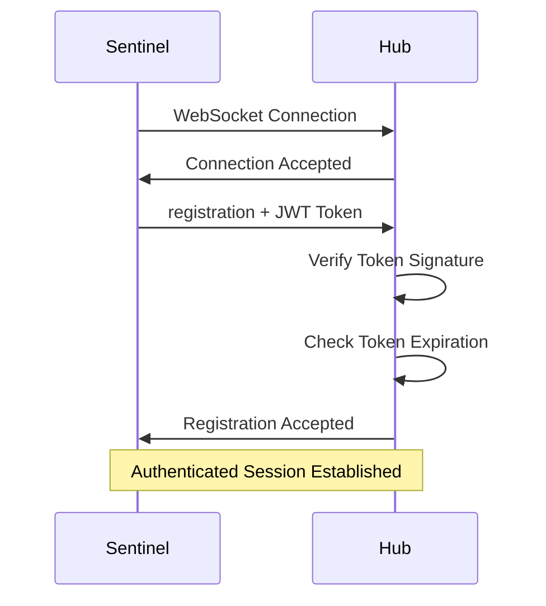

# 🔒 Starlight Protocol Security Guide

**Version:** 3.0.3  
**Date:** 2026-01-11  

Comprehensive security architecture and best practices for the Starlight Protocol.

---

## Table of Contents

1. [Security Overview](#1-security-overview)
2. [Authentication System](#2-authentication-system)
3. [Input Validation](#3-input-validation)
4. [Data Protection](#4-data-protection)
5. [Network Security](#5-network-security)
6. [Access Control](#6-access-control)
7. [Monitoring & Auditing](#7-monitoring--auditing)
8. [Security Best Practices](#8-security-best-practices)
9. [Incident Response](#9-incident-response)
10. [Threat Model](#10-threat-model)

---

## 1. Security Overview

The Starlight Protocol implements a defense-in-depth security model with multiple layers of protection:

### Security Layers
```
┌─────────────────────────────────────────┐
│         Network Layer (TLS/WSS)       │
├─────────────────────────────────────────┤
│      Authentication (JWT)             │
├─────────────────────────────────────────┤
│     Input Validation (Schema)         │
├─────────────────────────────────────────┤
│     Data Protection (PII Redaction)   │
├─────────────────────────────────────────┤
│     Access Control (RBAC)             │
├─────────────────────────────────────────┤
│    Monitoring & Auditing              │
└─────────────────────────────────────────┘
```

### Security Features
- ✅ **JWT Authentication** with timing-safe verification
- ✅ **Input Validation** with JSON schema enforcement
- ✅ **PII Protection** with automatic redaction
- ✅ **Rate Limiting** to prevent abuse
- ✅ **SSL/TLS Support** for encrypted communication
- ✅ **Audit Logging** for compliance
- ✅ **Role-Based Access Control** (RBAC)

---

## 2. Authentication System

### 2.1 JWT Implementation

The Starlight Protocol uses industry-standard JSON Web Tokens (JWT) for authentication:

#### Token Generation
```javascript
// src/auth/jwt_handler.js
const token = jwt.sign(
    {
        sub: sentinelName,
        iat: Math.floor(Date.now() / 1000),
        exp: Math.floor(Date.now() / 1000) + (config.tokenExpiry || 3600),
        jti: crypto.randomUUID()
    },
    config.jwtSecret,
    { algorithm: 'HS256' }
);
```

#### Token Verification
```javascript
// Timing-safe comparison prevents timing attacks
function timingSafeEqual(a, b) {
    if (a.length !== b.length) return false;
    let result = 0;
    for (let i = 0; i < a.length; i++) {
        result |= a.charCodeAt(i) ^ b.charCodeAt(i);
    }
    return result === 0;
}
```

### 2.2 Authentication Flow



### 2.3 Token Security Requirements

- **Secret Length**: Minimum 256 bits (32 characters)
- **Algorithm**: HMAC-SHA256 (HS256)
- **Expiration**: Configurable (default: 3600 seconds)
- **Claims**: `sub`, `iat`, `exp`, `jti`
- **Refresh**: Supported for long-running sessions

---

## 3. Input Validation

### 3.1 Schema Validation Pipeline

All incoming messages pass through comprehensive validation:

```javascript
// src/validation/schema_validator.js
class SchemaValidator {
    validateMessage(message) {
        // 1. Base message validation
        this.validateBase(message);
        
        // 2. Method-specific validation
        const schema = this.getSchema(message.method);
        const result = this.validate(message, schema);
        
        // 3. Security checks
        this.validateSecurity(message);
        
        return result;
    }
}
```

### 3.2 Validation Rules

| Validation Type | Description | Example |
|----------------|-------------|---------|
| **Format Validation** | JSON-RPC 2.0 compliance | `jsonrpc: "2.0"` |
| **Method Validation** | Allowed methods only | `starlight.*` pattern |
| **Type Checking** | Strict type validation | `string`, `number`, `boolean` |
| **Pattern Matching** | Regex validation | `selector` patterns |
| **Length Limits** | Prevent DoS attacks | Max 2000 characters |
| **Enum Validation** | Allowed values only | `cmd: ["click", "fill"]` |

### 3.3 Selector Injection Prevention

```javascript
// src/hub.js:28-38
function sanitizeSelector(selector) {
    if (!selector) return selector;
    
    // Remove dangerous characters
    const dangerous = /[#[].;\/()'"<>{}@\$%^&*+=|`~]/g;
    return selector.replace(dangerous, '');
}

// HTML escaping for XSS prevention
function escapeHtml(text) {
    const map = {
        '&': '&amp;',
        '<': '&lt;',
        '>': '&gt;',
        '"': '&quot;',
        "'": '&#39;'
    };
    return text.replace(/[&<>"']/g, m => map[m]);
}
```

---

## 4. Data Protection

### 4.1 PII Detection and Redaction

The PII Redactor automatically identifies and redacts sensitive information:

#### Detection Patterns
```javascript
// src/utils/pii_redactor.js
const PIIPatterns = {
    email: /\b[A-Za-z0-9._%+-]+@[A-Za-z0-9.-]+\.[A-Z|a-z]{2,}\b/g,
    phone: /\b\d{3}[-.]?\d{3}[-.]?\d{4}\b/g,
    creditCard: /\b\d{4}[-\s]?\d{4}[-\s]?\d{4}[-\s]?\d{4}\b/g,
    ssn: /\b\d{3}-\d{2}-\d{4}\b/g,
    jwt: /eyJ[A-Za-z0-9_-]*\.[A-Za-z0-9_-]*\.[A-Za-z0-9_-]*/g,
    apiKey: /(api[_-]?key|token)['":\s]*['"]?([a-zA-Z0-9_-]{16,})/gi
};
```

#### Redaction Process
```javascript
redact(data) {
    if (typeof data === 'string') {
        return this.redactString(data);
    } else if (typeof data === 'object' && data !== null) {
        return this.redactObject(data);
    }
    return data;
}

redactObject(obj) {
    const redacted = {};
    for (const [key, value] of Object.entries(obj)) {
        redacted[key] = this.redact(value);
    }
    return redacted;
}
```

### 4.2 Screenshot Protection

Screenshots are processed to protect visual PII:

```javascript
// src/warp_sanitizer.js:367-417
async function sanitizeScreenshot(screenshotBuffer) {
    // 1. PII detection in image metadata
    const metadata = await extractMetadata(screenshotBuffer);
    const piiDetected = detectPII(metadata);
    
    // 2. Optional blurring of sensitive regions
    if (piiDetected) {
        return await blurRegions(screenshotBuffer, piiRegions);
    }
    
    // 3. Encryption at rest
    return await encryptData(screenshotBuffer);
}
```

### 4.3 Encryption

Sensitive data is encrypted using AES-256-GCM:

```javascript
// src/warp_sanitizer.js
function encryptData(data) {
    const key = crypto.scryptSync(config.encryptionKey, 'salt', 32);
    const iv = crypto.randomBytes(16);
    const cipher = crypto.createCipher('aes-256-gcm', key, iv);
    
    const encrypted = Buffer.concat([
        cipher.update(data),
        cipher.final()
    ]);
    
    const authTag = cipher.getAuthTag();
    
    return {
        encrypted: encrypted.toString('base64'),
        iv: iv.toString('base64'),
        authTag: authTag.toString('base64')
    };
}
```

---

## 5. Network Security

### 5.1 SSL/TLS Configuration

For production deployments, enable WSS (WebSocket Secure):

```json
{
    "security": {
        "ssl": {
            "enabled": true,
            "keyPath": "./certs/server.key",
            "certPath": "./certs/server.crt",
            "caPath": "./certs/ca.crt",
            "rejectUnauthorized": true,
            "minVersion": "TLSv1.2"
        }
    }
}
```

### 5.2 Certificate Management

```bash
# Generate self-signed certificate (development)
openssl req -x509 -newkey rsa:4096 -keyout server.key -out server.crt -days 365

# Generate certificate signing request (production)
openssl req -new -newkey rsa:4096 -keyout server.key -out server.csr

# Best practices for production
- Use certificate from trusted CA
- Enable OCSP stapling
- Use strong cipher suites only
- Enable HSTS headers
```

### 5.3 Rate Limiting

```javascript
// src/hub.js: rate limiting implementation
class RateLimiter {
    constructor(maxRequests = 100, windowMs = 60000) {
        this.maxRequests = maxRequests;
        this.windowMs = windowMs;
        this.requests = new Map();
    }
    
    isAllowed(clientId) {
        const now = Date.now();
        const windowStart = now - this.windowMs;
        
        if (!this.requests.has(clientId)) {
            this.requests.set(clientId, []);
        }
        
        const clientRequests = this.requests.get(clientId);
        const validRequests = clientRequests.filter(time => time > windowStart);
        
        if (validRequests.length >= this.maxRequests) {
            return false;
        }
        
        validRequests.push(now);
        this.requests.set(clientId, validRequests);
        return true;
    }
}
```

---

## 6. Access Control

### 6.1 Role-Based Access Control (RBAC)

Define roles and permissions for different user types:

```javascript
// src/auth/rbac.js
const roles = {
    admin: {
        permissions: ['*'],
        description: 'Full system access'
    },
    operator: {
        permissions: [
            'starlight.intent',
            'starlight.context_update',
            'starlight.finish'
        ],
        description: 'Intent execution access'
    },
    viewer: {
        permissions: [
            'starlight.pulse',
            'starlight.entropy_stream'
        ],
        description: 'Read-only access'
    },
    sentinel: {
        permissions: [
            'starlight.registration',
            'starlight.pre_check',
            'starlight.clear',
            'starlight.wait',
            'starlight.hijack',
            'starlight.resume',
            'starlight.action'
        ],
        description: 'Sentinel protocol access'
    }
};
```

### 6.2 Permission Enforcement

```javascript
function hasPermission(token, method) {
    const payload = jwt.verify(token, config.jwtSecret);
    const userRole = payload.role || 'sentinel';
    const rolePermissions = roles[userRole].permissions;
    
    return rolePermissions.includes('*') || 
           rolePermissions.includes(method);
}
```

### 6.3 Resource-Based Access

```javascript
// Domain-based restrictions
const domainRestrictions = {
    'test-sentinel': ['*.test.example.com'],
    'prod-sentinel': ['*.example.com', '*.api.example.com']
};

function canAccessDomain(sentinelName, url) {
    const allowed = domainRestrictions[sentinelName] || [];
    return allowed.some(pattern => matchPattern(url, pattern));
}
```

---

## 7. Monitoring & Auditing

### 7.1 Security Event Logging

```javascript
// src/utils/security_logger.js
class SecurityLogger {
    logAuthAttempt(result, clientInfo) {
        const event = {
            timestamp: new Date().toISOString(),
            type: 'authentication',
            result: result, // 'success' | 'failure'
            client: {
                ip: clientInfo.ip,
                userAgent: clientInfo.userAgent,
                sentinelId: clientInfo.sentinelId
            }
        };
        
        this.writeLog(event);
    }
    
    logValidationFailure(method, errors, clientInfo) {
        const event = {
            timestamp: new Date().toISOString(),
            type: 'validation_error',
            method: method,
            errors: errors,
            client: clientInfo
        };
        
        this.writeLog(event);
    }
    
    logPIIEvent(action, data, redactionCount) {
        const event = {
            timestamp: new Date().toISOString(),
            type: 'pii_redaction',
            action: action,
            redactionCount: redactionCount,
            piiTypes: this.detectPIITypes(data)
        };
        
        this.writeLog(event);
    }
}
```

### 7.2 Security Metrics

Monitor these key security indicators:

| Metric | Threshold | Description |
|---------|-----------|-------------|
| Failed Auth Rate | < 5% | Authentication failure percentage |
| Input Validation Errors | < 1% | Validation error rate |
| PII Redactions | Tracked | Volume of sensitive data detected |
| Rate Limit Triggers | < 1/hour | Rate limiting activation frequency |
| Unusual Traffic | Anomaly detection | Deviation from baseline patterns |

### 7.3 Alert Configuration

```json
{
    "security": {
        "alerts": {
            "enabled": true,
            "channels": ["email", "slack", "webhook"],
            "thresholds": {
                "failedAuthRate": 0.05,
                "validationErrorRate": 0.01,
                "rateLimitHitRate": 0.001
            },
            "webhooks": [
                "https://alerts.example.com/security"
            ]
        }
    }
}
```

---

## 8. Security Best Practices

### 8.1 Deployment Security

#### Production Checklist
- [ ] Enable SSL/TLS with valid certificates
- [ ] Use strong JWT secrets (256-bit minimum)
- [ ] Enable input validation
- [ ] Configure rate limiting
- [ ] Enable audit logging
- [ ] Set up security monitoring
- [ ] Configure RBAC for different environments
- [ ] Enable PII redaction
- [ ] Regular security updates

#### Environment Separation
```json
{
    "development": {
        "security": {
            "ssl": { "enabled": false },
            "jwtSecret": "dev-secret-only",
            "rateLimiting": { "enabled": false }
        }
    },
    "production": {
        "security": {
            "ssl": { "enabled": true },
            "jwtSecret": "${JWT_SECRET}",
            "rateLimiting": { "enabled": true },
            "piiRedaction": true
        }
    }
}
```

### 8.2 Code Security

#### Sentinel Development
```python
# Secure sentinel development
class SecureSentinel(SentinelBase):
    def __init__(self):
        # Validate configuration
        super().__init__(
            layer_name=self.name,
            priority=self.priority,
            capabilities=self.capabilities
        )
        
        # Sanitize selectors
        self.selectors = [self.sanitize_selector(s) for s in self.selectors]
    
    def sanitize_selector(self, selector):
        # Remove dangerous characters
        return re.sub(r'[#[].;\/()\'"<>(){}@\$%^&*+=|`~]', '', selector)
    
    async def on_pre_check(self, params, msg_id):
        # Validate inputs
        self.validate_params(params)
        
        # Don't log sensitive data
        safe_params = self.redact_pii(params)
        self.logger.info(f"Processing pre_check: {safe_params}")
```

### 8.3 Configuration Security

```bash
# Use environment variables for secrets
export JWT_SECRET=$(openssl rand -hex 32)
export SSL_KEY_PATH="/etc/ssl/certs/server.key"
export SSL_CERT_PATH="/etc/ssl/certs/server.crt"

# File permissions
chmod 600 config.json
chmod 600 /etc/ssl/certs/server.key
chmod 644 /etc/ssl/certs/server.crt
```

---

## 9. Incident Response

### 9.1 Security Incident Types

| Incident Type | Severity | Response Time |
|---------------|-----------|--------------|
| Authentication Bypass | Critical | < 15 minutes |
| Data Exposure | High | < 1 hour |
| Denial of Service | Medium | < 4 hours |
| Configuration Error | Low | < 24 hours |

### 9.2 Response Procedures

#### Immediate Response (0-15 minutes)
1. **Isolate**: Disconnect affected clients
2. **Preserve**: Capture logs and system state
3. **Assess**: Determine scope and impact
4. **Notify**: Alert security team and stakeholders

#### Investigation (15 minutes - 4 hours)
1. **Analyze**: Review logs and audit trails
2. **Identify**: Determine root cause
3. **Document**: Record findings and timeline
4. **Plan**: Develop remediation strategy

#### Recovery (4-24 hours)
1. **Patch**: Apply security fixes
2. **Validate**: Test security controls
3. **Monitor**: Watch for recurrence
4. **Review**: Conduct post-incident analysis

### 9.3 Reporting Template

```markdown
## Security Incident Report

**Incident ID:** SEC-2026-001
**Date:** 2026-01-11
**Severity:** High
**Type:** Authentication Bypass

### Timeline
- 14:32 UTC - Anomaly detected in auth logs
- 14:35 UTC - Investigation started
- 14:45 UTC - Root cause identified
- 15:10 UTC - Patch deployed
- 15:15 UTC - Service restored

### Impact
- 2 sentinel connections compromised
- No data exposure detected
- Service availability: 98%

### Root Cause
JWT secret rotation failure due to manual configuration error

### Remediation
- Automated secret rotation implemented
- Additional validation added
- Monitoring enhanced

### Prevention
- Regular security audits scheduled
- Automated configuration validation
- Enhanced monitoring and alerting
```

---

## 10. Threat Model

### 10.1 Identified Threats

#### High Severity
| Threat | Vector | Impact | Mitigation |
|--------|---------|---------|------------|
| **Authentication Bypass** | Weak JWT secrets | Full system compromise | Strong secrets + token expiration |
| **Injection Attacks** | Malicious selectors | Code execution | Input validation + sanitization |
| **Data Exposure** | PII in logs | Privacy violations | Automatic PII redaction |
| **Man-in-the-Middle** | Unencrypted communication | Data interception | SSL/TLS encryption |

#### Medium Severity
| Threat | Vector | Impact | Mitigation |
|--------|---------|---------|------------|
| **Denial of Service** | Resource exhaustion | Service disruption | Rate limiting + quotas |
| **Unauthorized Access** | Weak RBAC | Privilege escalation | Role-based permissions |
| **Information Disclosure** | Verbose error messages | Reconnaissance aid | Secure error handling |

#### Low Severity
| Threat | Vector | Impact | Mitigation |
|--------|---------|---------|------------|
| **Configuration Errors** | Misconfiguration | Operational issues | Validation + documentation |
| **Version Exposure** | Old software | Known vulnerabilities | Regular updates |

### 10.2 Attack Trees

#### Authentication Bypass Attack Tree
```
Authentication Bypass
├── Weak JWT Secret
│   ├── Short secret length
│   ├── Predictable secret
│   └── Secret in version control
├── Token Manipulation
│   ├── Token tampering
│   ├── Token replay
│   └── Token expiration bypass
└── Implementation Flaws
    ├── Timing attacks
    ├── Signature verification bypass
    └── Algorithm confusion
```

#### Injection Attack Tree
```
Injection Attack
├── CSS Selector Injection
│   ├── Direct selector input
│   ├── Semantic goal manipulation
│   └── Context injection
├── Command Injection
│   ├── JavaScript execution
│   ├── System command execution
│   └── Browser API abuse
└── Data Injection
    ├── Malicious parameters
    ├── Oversized payloads
    └── Schema violations
```

### 10.3 Security Controls Matrix

| Control | Threats Mitigated | Implementation |
|----------|-------------------|----------------|
| **JWT Authentication** | Auth bypass, unauthorized access | `src/auth/jwt_handler.js` |
| **Input Validation** | Injection attacks, DoS | `src/validation/schema_validator.js` |
| **PII Redaction** | Data exposure | `src/utils/pii_redactor.js` |
| **SSL/TLS** | Man-in-the-middle | WebSocket server config |
| **Rate Limiting** | DoS, resource abuse | Connection management |
| **RBAC** | Privilege escalation | Role-based permissions |
| **Audit Logging** | Incident detection | `src/utils/security_logger.js` |

---

## Conclusion

The Starlight Protocol implements comprehensive security controls to protect against common threats in browser automation environments. By following this security guide and implementing the recommended practices, organizations can deploy Starlight with confidence in both security and compliance.

### Key Takeaways

1. **Defense in Depth**: Multiple security layers provide robust protection
2. **Zero Trust**: All inputs are validated and authenticated
3. **Privacy by Design**: PII is automatically protected
4. **Continuous Monitoring**: Security events are logged and monitored
5. **Incident Ready**: Clear response procedures for security events

For additional security questions or to report vulnerabilities, contact the security team at security@starlight-protocol.org.

---

*Last updated: 2026-01-11*  
*Next review: 2026-04-11*