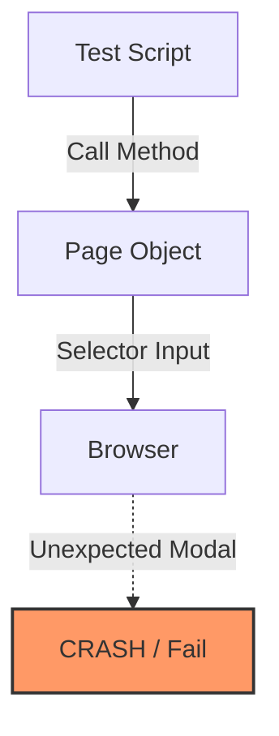
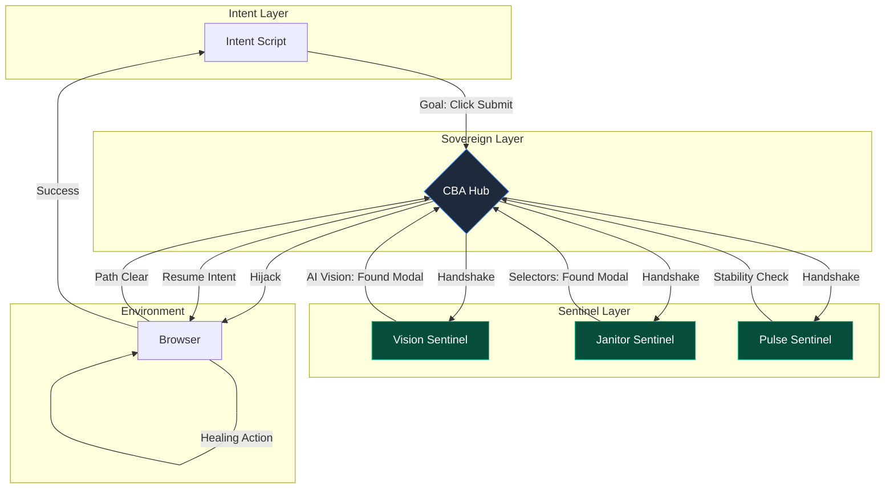
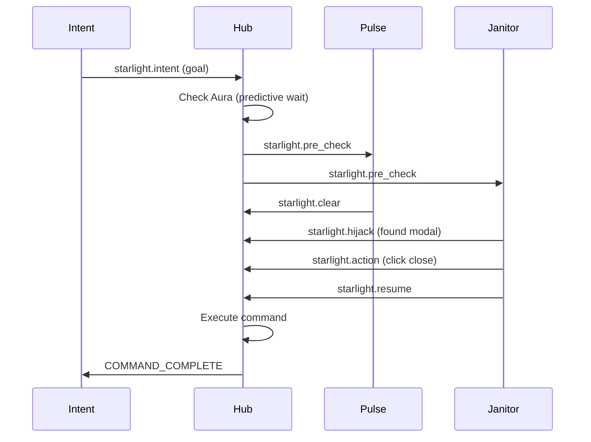

# CBA Technical Guide: Architecture & Implementation (v3.0)

This document provides a deep technical overview of Constellation-Based Automation (CBA), including the protocol specification, implementation details, security architecture, and configuration reference.

---

## 1. Architectural Comparison: POM vs CBA

### Traditional Page Object Model (POM)

**Weakness:** Test logic must handle every UI state, leading to complex conditional logic.

### Constellation-Based Automation (CBA)


---

## 2. Key Differences

| **Parameter** | **POM** | **CBA** |
| :--- | :--- | :--- |
| Logic Type | Linear / Procedural | Agentic / Goal-Oriented |
| Healing | Manual retry | **Predictive Memory** |
| Performance | Hard-coded waits | **Temporal Pulse** |
| ROI | Invisible | **Quantified Dashboard** |
| Outcome | Flaky | Stable via Sovereign Remediation |

---

## 3. The Starlight Protocol (v3.0)

### Message Format (JSON-RPC 2.0)
```json
{
    "jsonrpc": "2.0",
    "method": "starlight.<action>",
    "params": { ... },
    "id": "unique-id"
}
```

### Protocol Methods

| Method | Initiator | Purpose |
| :--- | :--- | :--- |
| `starlight.registration` | Sentinel | Register with Hub |
| `starlight.pulse` | Sentinel | Heartbeat signal |
| `starlight.intent` | Intent | Issue goal or command (with optional `stabilityHint`) |
| `starlight.pre_check` | Hub | Handshake before execution |
| `starlight.clear` | Sentinel | Approve execution |
| `starlight.wait` | Sentinel | Veto (stability concern) |
| `starlight.hijack` | Sentinel | Request browser lock |
| `starlight.resume` | Sentinel | Release lock |
| `starlight.action` | Sentinel | Execute healing action |
| `starlight.context_update` | Sentinel | Inject shared state |
| `starlight.entropy_stream` | Hub | Broadcast environment jitter |
| `starlight.finish` | Intent | End mission |
| `starlight.sidetalk` | Sentinel | Inter-Sentinel communication (Phase 17) |
| `starlight.warp_capture` | Client | Capture browser context to .warp file (Phase 17) |
| `starlight.warp_restore` | Client | Restore browser context from .warp file (Phase 17) |

---

## 4. Security Architecture

### 4.1 Authentication System

Starlight Protocol implements industry-standard JWT authentication for secure client identification.

#### JWT Handler Implementation
```javascript
// src/auth/jwt_handler.js
class JWThandler {
    constructor(secret, expiresIn = 3600) {
        this.secret = secret;
        this.expiresIn = expiresIn;
    }
    
    generateToken(payload) {
        // HMAC-SHA256 signing with timing-safe comparison
    }
    
    verifyToken(token) {
        // Signature verification + expiration validation
    }
}
```

#### Authentication Flow
1. **Token Generation**: Clients generate JWT using shared secret
2. **Registration**: Token included in `starlight.registration` message
3. **Validation**: Hub verifies token before accepting connection
4. **Session Management**: Token refresh for long-running sessions

### 4.2 Input Validation Pipeline

#### Schema Validator
All incoming messages are validated against JSON schemas:

```javascript
// src/validation/schema_validator.js
class SchemaValidator {
    validateMessage(message) {
        const schema = this.getSchema(message.method);
        const result = this.validate(message, schema);
        if (!result.valid) {
            throw new ValidationError(result.errors);
        }
    }
}
```

#### Validation Layers
- **Base Format**: JSON-RPC 2.0 compliance
- **Method Validation**: Method-specific parameter schemas
- **Type Checking**: Strict type validation for all fields
- **Pattern Matching**: Regex validation for strings (selectors, URLs)
- **Length Limits**: Maximum field length enforcement (2000 chars)

### 4.3 PII Protection System

#### PII Redactor
Comprehensive PII detection and redaction:

```javascript
// src/utils/pii_redactor.js
class PIIRedactor {
    patterns = {
        email: /\b[A-Za-z0-9._%+-]+@[A-Za-z0-9.-]+\.[A-Z|a-z]{2,}\b/g,
        phone: /\b\d{3}[-.]?\d{3}[-.]?\d{4}\b/g,
        creditCard: /\b\d{4}[-\s]?\d{4}[-\s]?\d{4}[-\s]?\d{4}\b/g,
        jwt: /eyJ[A-Za-z0-9_-]*\.[A-Za-z0-9_-]*\.[A-Za-z0-9_-]*/g
    };
    
    redact(data) {
        return this.recursiveRedact(data);
    }
}
```

#### Protection Layers
- **Log Sanitization**: All logs pass through PII redactor
- **Screenshot Protection**: Automatic PII detection in images
- **Data Export**: Warps and traces sanitized before storage
- **API Response**: Sensitive data filtered from responses

### 4.4 Security Configuration

```json
{
    "security": {
        "jwtSecret": "your-256-bit-secret-key",
        "tokenExpiry": 3600,
        "piiRedaction": true,
        "inputValidation": true,
        "ssl": {
            "enabled": false,
            "keyPath": "./certs/server.key",
            "certPath": "./certs/server.crt"
        },
        "rateLimiting": {
            "enabled": true,
            "maxRequests": 100,
            "windowMs": 60000
        }
    }
}
```

---

## 5. Configuration Reference

CBA v3.0 uses `config.json` for all settings:

```json
{
    "hub": {
        "port": 8080,
        "syncBudget": 30000,
        "missionTimeout": 180000,
        "heartbeatTimeout": 5000,
        "lockTTL": 5000,
        "entropyThrottle": 100,
        "screenshotMaxAge": 86400000,
        "traceMaxEvents": 500,
        "shadowDom": {
            "enabled": true,
            "maxDepth": 5
        }
    },
    "security": {
        "jwtSecret": "your-256-bit-secret-key",
        "tokenExpiry": 3600,
        "piiRedaction": true,
        "inputValidation": true,
        "ssl": {
            "enabled": false,
            "keyPath": null,
            "certPath": null
        },
        "rateLimiting": {
            "enabled": true,
            "maxRequests": 100,
            "windowMs": 60000
        }
    },
    "aura": {
        "preventiveWaitMs": 1500,
        "bucketSizeMs": 500
    },
    "sentinel": {
        "settlementWindow": 1.0,
        "reconnectDelay": 3,
        "heartbeatInterval": 2
    },
    "vision": {
        "model": "moondream",
        "timeout": 3,
        "ollamaUrl": "http://localhost:11434/api/generate"
    }
}
```

### Hub Settings

| Setting | Type | Default | Description |
|---------|------|---------|-------------|
| `port` | int | 8080 | WebSocket server port |
| `syncBudget` | int | 30000 | Max wait for handshake (ms) |
| `missionTimeout` | int | 180000 | Mission safety timeout (ms) |
| `heartbeatTimeout` | int | 5000 | Sentinel heartbeat timeout (ms) |
| `lockTTL` | int | 5000 | Hijack lock TTL (ms) |
| `entropyThrottle` | int | 100 | Min interval between entropy broadcasts (ms) |
| `screenshotMaxAge` | int | 86400000 | Auto-delete screenshots older than (ms) |
| `traceMaxEvents` | int | 500 | Max events in mission trace |
| `shadowDom.enabled` | bool | true | Enable shadow DOM traversal |
| `shadowDom.maxDepth` | int | 5 | Max shadow root nesting depth |

### Security Settings

| Setting | Type | Default | Description |
|---------|------|---------|-------------|
| `jwtSecret` | string | null | JWT signing secret (256-bit minimum) |
| `tokenExpiry` | int | 3600 | JWT token expiration time (seconds) |
| `piiRedaction` | bool | true | Enable PII detection and redaction |
| `inputValidation` | bool | true | Enable message schema validation |
| `ssl.enabled` | bool | false | Enable SSL/TLS encryption |
| `ssl.keyPath` | string | null | Path to SSL private key |
| `ssl.certPath` | string | null | Path to SSL certificate |
| `rateLimiting.enabled` | bool | true | Enable rate limiting |
| `rateLimiting.maxRequests` | int | 100 | Max requests per window |
| `rateLimiting.windowMs` | int | 60000 | Rate limit window (ms) |

---

## 4.5 Phase 9: Shadow DOM Penetration

CBA v2.8 can pierce Shadow DOM boundaries to detect and interact with encapsulated web components.

### Shadow-Piercing Selectors

Use the `>>>` combinator (Playwright's shadow-piercing syntax):

```javascript
// Standard selector (won't reach shadow DOM)
await page.click('.modal');

// Shadow-piercing selector (reaches into shadow roots)
await page.click('shadow-modal >>> .shadow-close-btn');
```

### Hub Behavior

The Hub's `resolveSemanticIntent` and `broadcastPreCheck` automatically:
1. Traverse up to `shadowDom.maxDepth` levels of shadow roots
2. Generate `>>>` selectors for elements inside shadow boundaries
3. Report `inShadow: true` in blocking element metadata

### JanitorSentinel Patterns

The Janitor registers shadow-aware patterns:
```python
self.blocking_patterns = [
    ".modal", ".popup", "#overlay",
    ">>> .modal", ">>> .popup",  # Shadow-piercing
]
```

### Sovereign Remediation

When clearing obstacles matching `shadow`, the Hub recursively hides elements across all shadow roots:
```javascript
function hideObstacles(root) {
    root.querySelectorAll('.modal, .shadow-overlay').forEach(el => {
        el.style.display = 'none';
    });
    root.querySelectorAll('*').forEach(el => {
        if (el.shadowRoot) hideObstacles(el.shadowRoot);
    });
}
hideObstacles(document);
```

---

## 4.6 Phase 16: Mutation Fingerprinting (Stability Sensing)

Starlight v3.0 introduces **Stability Sensing** to eliminate manual waits.

### The Mutation Observer
The Test Recorder injects a `MutationObserver` that monitors DOM entropy after every interaction:
1. **Trigger**: User clicks or types.
2. **Track**: High-resolution tracking of all mutations (attributes, children, subtree).
3. **Analyze**: Defines "Settled" as a 500ms window with zero mutations.
4. **Encode**: Saves the `settleTime` (Action to Silence) as a metadata hint.

### Context-Aware Waiting
The **Pulse Sentinel** consumes this hint to dynamically adjust its `settleWindow`. If the hint is `450ms`, the Sentinel adds this to its baseline, ensuring it doesn't grant execution consent until the environmental jitter has subsided.

---

## 4.7 bin/starlight.js: The Autonomous Orchestrator

The unified CLI entry point for CI/CD environments.

### Orchestration Lifecycle
1. **Hub Launch**: Spawns Hub process + waits for `/health` response.
2. **Constellation Assembly**: Launches configured Sentinels (Pulse, Janitor).
3. **Mission Execution**: Spawns the intent script.
4. **Graceful Cleanup**: Kills all child processes (using `taskkill /t` on Windows) to ensure telemetry and reports are saved.

---

## 5. Starlight SDK (Python)

### Base Class Structure
```python
from sdk.starlight_sdk import SentinelBase

class MySentinel(SentinelBase):
    def __init__(self):
        super().__init__(layer_name="MySentinel", priority=10)
        self.selectors = [".my-pattern"]
        self.capabilities = ["custom-feature"]

    async def on_pre_check(self, params, msg_id):
        # Analyze params, then:
        await self.send_clear()  # or send_wait() or send_hijack()

    async def on_message(self, method, params, msg_id):
        # Handle broadcasts (e.g., COMMAND_COMPLETE)
        pass
```

### SDK Features (v3.0)

| Feature | Description |
|---------|-------------|
| **JWT Authentication** | Automatic token generation and refresh |
| **Message Validation** | Built-in schema validation |
| **Persistent Memory** | `self.memory` dict, auto-loaded/saved |
| **Graceful Shutdown** | SIGINT/SIGTERM handlers |
| **Atomic Writes** | Temp file + rename pattern |
| **Config Loading** | Reads `config.json` automatically |
| **Auto-Reconnect** | Retries on connection failure |
| **Proper Exceptions** | No silent error swallowing |
| **PII Protection** | Automatic data sanitization |

### Communication Methods
```python
# Basic protocol methods
await self.send_clear()           # Approve execution
await self.send_wait(1000)        # Veto with delay (ms)
await self.send_hijack("reason")  # Request browser lock
await self.send_resume()          # Release lock
await self.send_action("click", selector)  # Execute action
await self.update_context({...})  # Inject shared state

# Security features
await self.authenticate_with_token(jwt_token)  # Authenticate
await self.validate_and_send(message)  # Validate before sending
await self.redact_pii(data)  # Sanitize sensitive data

# Phase 17: Inter-Sentinel Side-Talk
await self.send_sidetalk("A11ySentinel", "query", {...})  # Direct message
await self.broadcast_state(stable=True, mutation_rate=0)  # Broadcast to all
```

---

## 5.1 Phase 17: Inter-Sentinel Side-Talk

Sentinels can communicate directly with each other through the Hub's routing:

### Usage Examples
```python
# Send to specific Sentinel
await self.send_sidetalk(
    to="A11ySentinel",
    topic="environment_state",
    payload={"stable": True, "mutationRate": 0}
)

# Broadcast to all Sentinels
await self.send_sidetalk(
    to="*",
    topic="action_proposal",
    payload={"action": "clear_modal"}
)
```

### Handling Messages
```python
async def on_sidetalk(self, params):
    sender = params.get("from")
    topic = params.get("topic")
    payload = params.get("payload")
    
    if topic == "environment_state" and payload.get("stable"):
        print(f"[{self.layer}] Environment stable per {sender}")
```

### Availability Handling
If a target Sentinel is unavailable, the sender receives:
```python
async def on_sidetalk_ack(self, params):
    if params.get("status") == "undeliverable":
        print(f"Target unavailable: {params.get('reason')}")
        print(f"Available: {params.get('availableSentinels')}")
```

---

## 5.2 Phase 17: Starlight Warp (Context Serialization)

Capture complete browser state for instant failure triage and debugging.

### Warp Capture
```javascript
// Trigger via WebSocket message
ws.send(JSON.stringify({
    jsonrpc: '2.0',
    method: 'starlight.warp_capture',
    params: { reason: 'mission_failure', sanitize: true },
    id: 'warp-1'
}));
```

### Warp File Contains
| Field | Description |
|-------|-------------|
| `url` | Current page URL |
| `storage` | localStorage & sessionStorage |
| `cookies` | All cookies |
| `dom` | Full HTML snapshot |
| `screenshot` | Base64 PNG image |
| `console` | Last 100 console logs |
| `network` | Pending/completed requests |

### PII Sanitization (Enabled by Default)
The sanitizer automatically redacts:
- Email addresses → `[EMAIL_REDACTED]`
- Credit cards → `[CREDITCARD_REDACTED]`
- JWTs/Tokens → `[JWT_REDACTED]`
- Passwords → `[REDACTED_STORAGE]`
- Session cookies → `[REDACTED_COOKIE]`

### Restore from Warp
```javascript
ws.send(JSON.stringify({
    jsonrpc: '2.0',
    method: 'starlight.warp_restore',
    params: { filepath: 'warps/warp_mission_failure_2026-01-04.warp' },
    id: 'warp-restore-1'
}));
```

### Configuration
```json
{
    "warp": {
        "outputDir": "./warps",
        "encryptionKey": null
    }
}
```

---

## 5.3 Phase 17: Consensus Mesh (Quorum Protocol)

The Hub supports decentralized decision-making through weight-based voting.

### Quorum Configuration
```json
{
    "hub": {
        "quorumThreshold": 0.6,
        "consensusTimeout": 5000
    }
}
```

### Voting Logic
- **Quorum Met**: If `total_confidence >= total_sentinels * quorumThreshold`, the Hub proceeds immediately.
- **Veto Supremacy**: Any `starlight.wait` or `starlight.hijack` signal overrides the quorum and stops execution.
- **Confidence Scores**: Sentinels can specify `confidence` (0.0 - 1.0) in their response to weight their vote.

---

## 5.4 Phase 17: Temporal Ghosting

Identify the environmental "speed limit" by running missions without state-changing actions.

### Ghost Mode
Enable `ghostMode` in `config.json` to perform observation-only runs. The Hub will track the time it takes for UI elements to settle and for Sentinels to clear the path.

### Temporal Optimization
Metrics are saved to `temporal_ghosting.json`. In subsequent runs, the Hub loads these observations and injects them as `stabilityHint` values to proactively slow down for known slow UI transitions.

---

## 6. Phase 7: Predictive Intelligence

### Historical Learning Engine
The Hub parses `mission_trace.json` on startup:

```javascript
trace.forEach(event => {
    // Learn selectors
    if (event.method === 'starlight.intent' && event.params.goal && event.params.selector) {
        this.historicalMemory.set(event.params.goal, event.params.selector);
    }
    // Learn entropy auras
    if (event.method === 'starlight.entropy_stream') {
        const bucket = Math.floor((event.timestamp - traceStart) / 500);
        this.historicalAuras.add(bucket);
    }
});
```

### Temporal Aura Mapping
Entropy events are quantized into 500ms buckets:
```javascript
const bucket = Math.floor(relativeTime / 500);
if (historicalAuras.has(bucket)) {
    await delay(config.aura.predictiveWaitMs);
}
```

### Sentinel Learning
Sentinels track successful remediations:
```python
# On success feedback
self.memory[obstacle_id] = successful_selector
self._save_memory()  # Atomic write to JSON
```

---

## 7. ROI Quantization Model

| Event Type | Value Added |
|------------|-------------|
| Sentinel Remediation | 5 min + duration |
| Self-Healing | 2-3 min |
| Aura Stabilization | 30 sec |

All metrics are summed into `totalSavedTime` and displayed in `report.html`.

---

## 8. File Structure

```
cba/
├── config.json          # Centralized configuration
├── requirements.txt     # Python dependencies
├── package.json         # Node.js metadata
├── CHANGELOG.md         # Version history
├── src/
│   ├── hub.js           # CBA Hub (orchestrator)
│   └── intent.js        # Example intent script
├── sdk/
│   └── starlight_sdk.py # Sentinel base class
├── sentinels/
│   ├── pulse_sentinel.py    # Stability monitor
│   ├── janitor.py           # Heuristic healer
│   ├── vision_sentinel.py   # AI analyzer
│   └── data_sentinel.py     # Context injector
├── test/
│   ├── intent_learning.js   # Learning demo
│   └── learning_test.html   # Test page
└── screenshots/         # Auto-cleaned daily
```

---

## 9. Mission Lifecycle



---

## 10. Best Practices

1. **Use Semantic Goals**: Prefer `{ goal: 'Login' }` over selectors
2. **Let Sentinels Learn**: Run missions multiple times to build memory
3. **Monitor ROI**: Check `report.html` for quantified value
4. **Configure Timeouts**: Adjust `syncBudget` for slow environments
5. **Clean Shutdown**: Always use Ctrl+C to preserve sentinel memory


---

## 4.6 Phase 18: Universal Protocol (Extended Commands)

v1.2.1 introduces the Universal Protocol, expanding the IntentRunner API to cover all standard interaction types with semantic goal resolution.

### Extended Command Set

| Command | Resolver | Fallback |
|---------|----------|----------|
| `upload(selector, files)` | Direct selector | N/A |
| `uploadGoal(goal, files)` | `resolveFormIntent` | Historical Memory |
| `selectGoal(goal, value)` | `resolveSelectIntent` | Historical Memory |
| `checkGoal(goal)` | `resolveCheckboxIntent` | Historical Memory |
| `hoverGoal(goal)` | `resolveSemanticIntent` | Historical Memory |
| `scrollToGoal(goal)` | `resolveSemanticIntent` | Historical Memory |

### Upload Implementation

File uploads are handled via Playwright's `setInputFiles` API, abstracted through the Hub to support both direct selectors and semantic resolution (finding file inputs by label text).

```javascript
// Semantic Upload Example
await runner.uploadGoal('Resume', './cv.pdf');
// Resolves to: <input type="file" id="cv_upload"> via label "Resume"
```

---

*Starlight Protocol v3.0 — The Autonomous Era*
