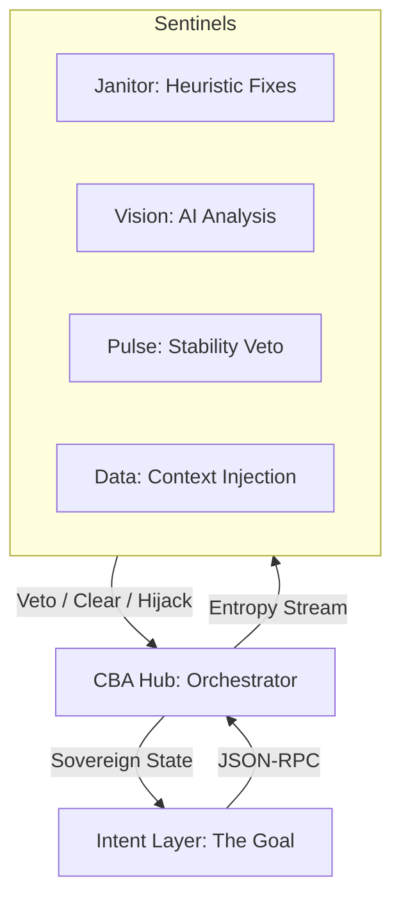

# 🌌 Starlight Protocol: The GALAXY User Guide (v3.0.3)

Welcome to the future of browser automation. This guide explains **Constellation-Based Automation (CBA)**—a paradigm shift from traditional Page Object Models (POM) and flaky `wait_for` calls toward a sovereign, multi-agent ecosystem.

---

## 1. The Core Philosophy: Why CBA?

Traditional automation is **brittle** because it couples the "Goal" (What you want) with the "Environment" (The chaos of the site). When a popup appears or the network lags, your script dies.

**CBA decouples them:**
- **The Intent Layer**: Only cares about the goal (e.g., "Login").
- **The Sentinels**: Guardians that watch the environment 24/7 and clear obstacles *before* they block the intent.
- **The Hub**: The "Air Traffic Controller" that orchestrates the two.

---

## 2. Architecture Overview



---

## 3. Quick Start

### Prerequisites
- **Node.js** v18+ and **Python** 3.9+
- **Playwright**: `npx playwright install chromium`
- **Python deps**: `pip install -r requirements.txt`
- **Ollama** (optional): For AI Vision Sentinel

### Running a Mission

**Option A: One-Command Execution (The Autonomous Way)**
```bash
# Hub + Sentinels + Intent in one command
node bin/starlight.js test/intent_portfolio_v2.js --headless --verbose
```
This script handles the entire lifecycle: spawning the constellation, running the mission, and cleaning up.

**Option B: Manual Launch (For Development)**
```bash
# Terminal 1: Hub
node src/hub.js

# Terminal 2: Pulse Sentinel
python sentinels/pulse_sentinel.py

# Terminal 3: Janitor Sentinel
python sentinels/janitor.py

# Terminal 4: Run Intent
node src/intent.js
```

---

## 4. Configuration

CBA v2.7 introduces centralized configuration via `config.json`:

```json
{
    "hub": {
        "port": 8080,
        "syncBudget": 30000,
        "missionTimeout": 180000,
        "screenshotMaxAge": 86400000,
        "traceMaxEvents": 500
    },
    "aura": {
        "predictiveWaitMs": 1500
    },
    "sentinel": {
        "settlementWindow": 1.0,
        "reconnectDelay": 3
    },
    "vision": {
        "model": "moondream",
        "timeout": 25
    }
}
```

| Setting | Default | Description |
|---------|---------|-------------|
| `syncBudget` | 30000 | Max wait (ms) for sentinel handshake |
| `missionTimeout` | 180000 | Max mission duration (ms) |
| `screenshotMaxAge` | 86400000 | Auto-delete screenshots older than 24h |
| `traceMaxEvents` | 500 | Max events in mission trace |
| `settlementWindow` | 1.0 | Seconds of silence required for stability |

---

## 5. Semantic Intent (Phase 5)

You no longer need to find selectors. Just tell the Hub what you want to achieve.

```javascript
// Old Way (Procedural)
await page.click('#submit-12345');

// CBA Way (Semantic)
await this.send({ goal: 'INITIATE MISSION' });
```
The Hub's **Semantic Resolver** will scan the page's accessibility layer and text content to find the correct element for you.

---

## 6. Understanding the Sentinels

### 💓 The Pulse Sentinel (Stability)
The Guardian of Time. It eliminates flakiness by ensuring the environment is stable before any action.
- **Now uses SDK**: Inherits from `SentinelBase` for consistency
- **Auto-reconnect**: Retries connection if Hub restarts

### 🧹 The Janitor Sentinel (Heuristics)
Detects known obstacles (modals, cookie banners) and hijacks control to clear them.
- **Persistent Memory**: Remembers which selectors worked
- **Predictive Mode**: Uses learned selectors on subsequent runs

### 👁️ The Vision Sentinel (AI-Driven)
Uses Local AI (Ollama) to visually detect obstacles without selectors.
- **Configurable Model**: Set via `config.json`
- **Timeout Handling**: Graceful fallback on Ollama timeout

### 📊 The Data Sentinel (Intelligence)
Extracts real metadata from commands and injects it into the shared context.

---

## 7. Phase 7: Predictive Intelligence & The Galaxy Mesh

CBA is no longer just a listener; it is a **learner**.

### 🧬 Self-Healing Selectors
When a UI change breaks a selector, the Hub switches from **Reactive** to **Predictive** mode:
1.  **Failure Detected**: A command fails to find its target.
2.  **Memory Retrieval**: The Hub consults its `historicalMemory`.
3.  **Substitution**: It automatically retries with a historically successful selector.
4.  **Proof**: The event is tagged with a **SELF-HEALED** badge in the report.

### 🌀 What is an Aura?
An **Aura** is a temporal window of high environment entropy. By learning these "Auras" from past runs, the Hub can proactively slow down its mission pace *before* a failure occurs.

### 🏛️ Sovereign Intelligence (Sentinel Learning)
Sentinels possess a **Persistent Memory Layer**:
- **Experience Accumulation**: Records winning selectors
- **Predictive Remediation**: Skips exploration on known obstacles
- **Local Persistence**: JSON files like `JanitorSentinel_memory.json`
- **Graceful Shutdown**: Memory saved on Ctrl+C

---

## 8. Phase 16: The Autonomous Era (NEW)

### What's New in v3.0

| Feature | Description |
|---------|-------------|
| **CLI Orchestrator** | `starlight.js` for zero-touch lifecycle management |
| **Mutation Fingerprinting** | Captures page "stability signatures" during recording |
| **Context-Aware Pulse** | Dynamic settle-time adjustment for heavy UIs |
| **Failure-Safe Reports** | Immediate report generation on mission failure |
| **Health Check** | `/health` endpoint for Hub system verification |

### 🎬 No-Code Marker HUD (v3.0.1)

The Mission Control UI includes a **Test Recorder** that captures user interactions without writing code:

1. **Start Recording**: Enter a URL in Mission Control and click `🔴 Record`
2. **HUD Appears**: A floating badge appears in the bottom-right corner of the browser
3. **Click the Badge**: Expands to show the control panel

**HUD Controls:**
| Button | Action |
|--------|--------|
| 🏷️ Tag Next Click | Assign a custom goal name to the next click |
| Checkpoint Input | Text field to enter checkpoint name |
| 🚩 Save Checkpoint | Record a logical milestone in your test |
| ⏹️ Stop Recording | End the session and generate the intent file |

**Example Workflow:**
1. Click "🏷️ Tag Next Click" → Click on Login button → Name it "Login"
2. Type "LoginComplete" in the checkpoint input → Click "🚩 Save Checkpoint"
3. Continue interacting with the site...
4. Click "⏹️ Stop Recording" when done

The generated intent file will appear in the `test/` directory and be available in Mission Control.

---

## 9. Time-Travel Triage (Phase 6)

CBA features **Time-Travel Triage**, allowing you to inspect missions with surgical precision.

### How to use the Triage Tool
1.  **Run Mission**: A `mission_trace.json` file is generated.
2.  **Open Triage**: Open `triage.html` in any browser.
3.  **Load Trace**: Click "Load mission_trace.json".
4.  **Rewind**: Select any event to see the browser state.

---

## 10. Phase 15: Visual Sentinel Editor & Fleet Manager (NEW in v3.0.3)

### 🛠️ Creating Custom Sentinels (No-Code)

The **Visual Sentinel Editor** lets anyone build a custom Sentinel without writing Python code.

**How to Access:**
1. Open Mission Control at `http://localhost:3000`
2. Click **"🛠️ Create Sentinel"** button
3. Or navigate directly to `http://localhost:3000/sentinel-editor`

**Creating a Sentinel:**

| Step | Action |
|------|--------|
| 1. Choose Template | Click "Cookie Banner", "Modal Popup", etc. (or start blank) |
| 2. Configure | Set name, priority (1-10), and capabilities |
| 3. Add Patterns | Enter CSS selectors to watch (e.g., `.cookie-banner`, `#popup`) |
| 4. Set Action | Choose: Click element, Hide element, or Wait & retry |
| 5. Preview | See the generated Python code in real-time |
| 6. Export | Click "🚀 Export Sentinel" → Saved to `sentinels/` |

**Built-in Templates:**
- **Cookie Banner**: Dismisses GDPR/cookie consent popups
- **Modal Popup**: Closes modals and overlays
- **Login Wall**: Detects authentication blockers
- **Rate Limiter**: Handles rate limits and CAPTCHAs

### 🛰️ Sentinel Fleet Manager

Mission Control now dynamically discovers ALL sentinels in the `sentinels/` directory.

**Features:**
- **Auto-Discovery**: Any `*.py` file in `sentinels/` appears as a card
- **Start/Stop Individual**: Click the button on any sentinel card
- **Start All**: Launches the entire constellation with one click
- **Visual Status**: Green (running) or black (stopped) indicators

**How It Works:**
1. Sentinels connect to the Hub via WebSocket
2. On each action, the Hub sends `PRE_CHECK` to ALL sentinels
3. Each sentinel responds: `CLEAR` (no problem) or `HIJACK` (I'll handle this)
4. Only relevant sentinels take action; others stay silent

---

## 11. Webhook Alerting (Phase 10)

Get notified on Slack, Teams, or Discord when missions complete.

**Configuration:**
```json
// config.json
"webhooks": {
    "enabled": true,
    "urls": ["https://hooks.slack.com/services/XXX"],
    "notifyOn": ["failure", "success"]
}
```

**Payload includes:**
- Mission name and status (success/failure)
- Duration and intervention count
- Mean Time To Recovery (MTTR)

---

## 12. Troubleshooting

| Issue | Solution |
|-------|----------|
| AI Analysis Timed Out | Ensure Ollama is running with `moondream` |
| Goal Resolution Failed | Ensure button has visible text or aria-label |
| System Unresponsive | Check Hub console for "UNRESPONSIVE" errors |
| Sentinel Won't Connect | Verify Hub is running on port 8080 |
| Memory Not Saved | Ensure graceful shutdown (Ctrl+C, not kill) |
| Start All not working | Ensure sentinel filenames end in `.py` |
| Custom Sentinel not appearing | Check it's in `sentinels/` directory |

---

🌠 *The stars in the constellation are many, but the intent is one.*
