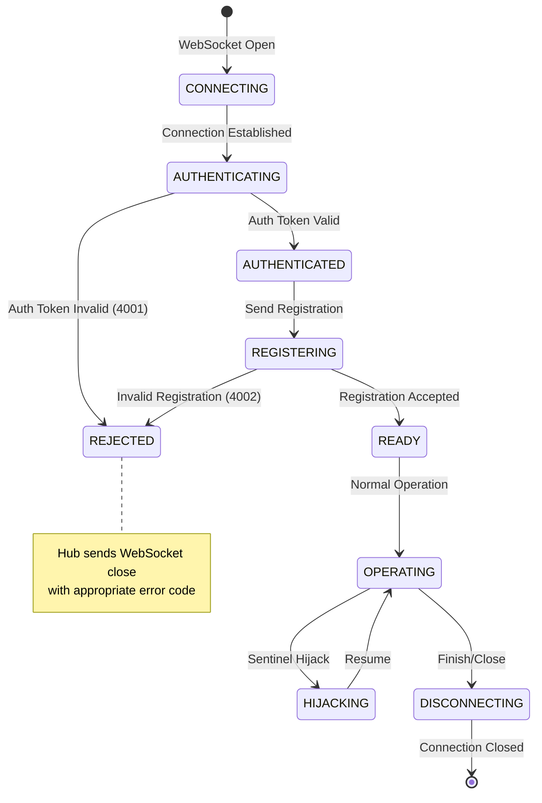

# The Starlight Protocol Specification

**Version:** 1.0.0  
**Status:** Standard  
**Date:** 2026-01-02  
**Author:** Dhiraj Das  

---

## Abstract

The Starlight Protocol is a communication standard for coordinating autonomous agents in browser automation environments. It defines a message-passing architecture where a central orchestrator (the Hub) coordinates with specialized monitoring agents (Sentinels) to ensure reliable execution of user intents in chaotic web environments.

This specification defines the protocol's message format, required methods, lifecycle events, and compliance requirements for implementations.

---

## Table of Contents

1. [Introduction](#1-introduction)
2. [Terminology](#2-terminology)
3. [Architecture](#3-architecture)
4. [Message Format](#4-message-format)
5. [Protocol Methods](#5-protocol-methods)
6. [Lifecycle](#6-lifecycle)
7. [Compliance Requirements](#7-compliance-requirements)
8. [Security Considerations](#8-security-considerations)
9. [IANA Considerations](#9-iana-considerations)

---

## 1. Introduction

### 1.1 Purpose

Traditional browser automation frameworks suffer from environmental instability—popups, network delays, and DOM mutations cause test failures unrelated to application logic. The Starlight Protocol addresses this by separating **intent** (what the user wants to accomplish) from **environment management** (handling obstacles).

### 1.2 Scope

This specification defines:
- The message format for Hub-Sentinel communication
- Required and optional protocol methods
- The handshake lifecycle for action execution
- Compliance requirements for implementations

### 1.3 Requirements Language

The key words "MUST", "MUST NOT", "REQUIRED", "SHALL", "SHALL NOT", "SHOULD", "SHOULD NOT", "RECOMMENDED", "MAY", and "OPTIONAL" in this document are to be interpreted as described in [RFC 2119](https://www.rfc-editor.org/rfc/rfc2119).

---

## 2. Terminology

**Hub**: The central orchestrator that manages browser context and coordinates Sentinel responses.

**Sentinel**: An autonomous agent that monitors a specific aspect of the browser environment (e.g., DOM stability, visual obstacles, network activity).

**Intent**: A client that issues high-level goals or commands to the Hub.

**Handshake**: The pre-execution consultation process where the Hub queries all Sentinels before performing an action.

**Hijack**: The process by which a Sentinel temporarily takes control of the browser to perform corrective actions.

**Sovereign State**: The shared context maintained by the Hub, accessible to all connected clients.

**Entropy**: A measure of environmental instability (DOM mutations, network activity).

---

## 3. Architecture

### 3.1 Component Diagram

```
┌─────────────────────────────────────────────────────────────────┐
│                         INTENT LAYER                            │
│                    (Test Scripts, Users)                        │
└───────────────────────────┬─────────────────────────────────────┘
                            │ starlight.intent
                            ▼
┌─────────────────────────────────────────────────────────────────┐
│                           HUB                                   │
│                   (Central Orchestrator)                        │
│  - Browser Management                                           │
│  - Message Routing                                              │
│  - Handshake Coordination                                       │
│  - Sovereign State                                              │
└───────────────────────────┬─────────────────────────────────────┘
                            │ starlight.pre_check
        ┌───────────────────┼───────────────────┐
        ▼                   ▼                   ▼
┌─────────────┐     ┌─────────────┐     ┌─────────────┐
│  Sentinel   │     │  Sentinel   │     │  Sentinel   │
│  (Pulse)    │     │  (Janitor)  │     │  (Vision)   │
│ Priority: 1 │     │ Priority: 5 │     │ Priority: 7 │
└─────────────┘     └─────────────┘     └─────────────┘
        │                   │                   │
        └───────────────────┼───────────────────┘
                            │ starlight.clear / wait / hijack
                            ▼
┌─────────────────────────────────────────────────────────────────┐
│                        BROWSER                                  │
│                  (Managed by Hub)                               │
└─────────────────────────────────────────────────────────────────┘
```

### 3.2 Transport

Implementations MUST use WebSocket as the transport layer. The Hub MUST listen on a configurable port (default: 8080).

### 3.3 Priority

Sentinels MUST declare a priority (1-10) during registration. Lower numbers indicate higher priority. The Hub SHOULD process responses in priority order when resolving conflicts.

### 3.4 Connection Lifecycle

The following state machine defines the connection lifecycle for all clients (Sentinels and Intents):



#### State Definitions

| State | Description | Timeout | Exit Condition |
|-------|-------------|---------|----------------|
| `CONNECTING` | WebSocket handshake in progress | 5s | Connection established or failed |
| `AUTHENTICATING` | Validating auth token (if security enabled) | 5s | Token validated or rejected |
| `REGISTERING` | Processing registration message | 5s | Registration accepted or rejected |
| `READY` | Client registered, awaiting commands | None | Command received or disconnect |
| `OPERATING` | Actively processing commands/pre_checks | Per command | Command complete or hijack |
| `HIJACKING` | Sentinel has exclusive browser control | lockTTL (5s) | Resume or TTL expired |
| `DISCONNECTING` | Graceful shutdown in progress | 10s | Cleanup complete |

#### Error Codes

| Code | Reason | Description |
|------|--------|-------------|
| 4001 | Unauthorized | Auth token validation failed |
| 4002 | Invalid Registration | Registration message malformed or rejected |
| 4003 | Protocol Error | Message format invalid |

---

## 4. Message Format

### 4.1 Base Format

All messages MUST conform to [JSON-RPC 2.0](https://www.jsonrpc.org/specification).

```json
{
    "jsonrpc": "2.0",
    "method": "starlight.<method_name>",
    "params": { ... },
    "id": "<unique_identifier>"
}
```

### 4.2 Method Naming

All Starlight methods MUST be prefixed with `starlight.` followed by the method name in snake_case.

### 4.3 Identifier

The `id` field MUST be a unique string. Implementations SHOULD use timestamps or UUIDs.

---

## 5. Protocol Methods

### 5.1 Registration Methods

#### 5.1.1 starlight.registration

**Direction:** Sentinel → Hub  
**Purpose:** Register a Sentinel with the Hub.  
**Required:** YES

**Parameters:**
| Field | Type | Required | Description |
|-------|------|----------|-------------|
| layer | string | YES | Unique name of the Sentinel |
| priority | integer | YES | Priority level (1-10, lower = higher) |
| capabilities | array[string] | NO | List of capabilities |
| selectors | array[string] | NO | CSS selectors this Sentinel monitors |

**Example:**
```json
{
    "jsonrpc": "2.0",
    "method": "starlight.registration",
    "params": {
        "layer": "JanitorSentinel",
        "priority": 5,
        "capabilities": ["detection", "healing"],
        "selectors": [".modal", ".popup", "#overlay"]
    },
    "id": "reg-1704215091"
}
```

#### 5.1.2 starlight.pulse

**Direction:** Sentinel → Hub  
**Purpose:** Heartbeat signal to indicate Sentinel is alive.  
**Required:** YES

**Parameters:**
| Field | Type | Required | Description |
|-------|------|----------|-------------|
| layer | string | YES | Name of the Sentinel |

### 5.2 Intent Methods

#### 5.2.1 starlight.intent

**Direction:** Intent → Hub  
**Purpose:** Issue a command or goal to the Hub.  
**Required:** YES

**Parameters:**
| Field | Type | Required | Description |
|-------|------|----------|-------------|
| cmd | string | NO* | Command type: `goto`, `click`, `fill`, `clear` |
| goal | string | NO* | Semantic goal description |
| selector | string | NO | CSS/XPath selector for target element |
| value | string | NO | Value for `fill` commands |
| stabilityHint | integer | NO | Recorded stability time in milliseconds |

*At least one of `cmd` or `goal` MUST be provided.

**Example (Command):**
```json
{
    "jsonrpc": "2.0",
    "method": "starlight.intent",
    "params": {
        "cmd": "click",
        "selector": "#submit-btn",
        "stabilityHint": 450
    },
    "id": "intent-1704215092"
}
```

**Example (Semantic Goal):**
```json
{
    "jsonrpc": "2.0",
    "method": "starlight.intent",
    "params": {
        "goal": "INITIATE CHECKOUT"
    },
    "id": "intent-1704215093"
}
```

### 5.3 Handshake Methods

#### 5.3.1 starlight.pre_check

**Direction:** Hub → Sentinel  
**Purpose:** Request environmental assessment before action execution.  
**Required:** YES

**Parameters:**
| Field | Type | Required | Description |
|-------|------|----------|-------------|
| command | object | YES | The pending intent |
| blocking | array[object] | NO | Elements matching Sentinel's selectors |
| screenshot | string | NO | Base64-encoded screenshot |
| url | string | NO | Current page URL |

#### 5.3.2 starlight.clear

**Direction:** Sentinel → Hub  
**Purpose:** Approve action execution.  
**Required:** YES

**Parameters:** None required.

#### 5.3.3 starlight.wait

**Direction:** Sentinel → Hub  
**Purpose:** Veto action execution due to environmental instability.  
**Required:** YES

**Parameters:**
| Field | Type | Required | Description |
|-------|------|----------|-------------|
| retryAfterMs | integer | NO | Suggested retry delay in milliseconds |

#### 5.3.4 starlight.hijack

**Direction:** Sentinel → Hub  
**Purpose:** Request exclusive browser control.  
**Required:** YES

**Parameters:**
| Field | Type | Required | Description |
|-------|------|----------|-------------|
| reason | string | YES | Human-readable explanation |

#### 5.3.5 starlight.resume

**Direction:** Sentinel → Hub  
**Purpose:** Release browser control after hijack.  
**Required:** YES

**Parameters:**
| Field | Type | Required | Description |
|-------|------|----------|-------------|
| re_check | boolean | NO | Whether Hub should re-run PRE_CHECK (default: true) |

### 5.4 Action Methods

#### 5.4.1 starlight.action

**Direction:** Sentinel → Hub  
**Purpose:** Request the Hub to perform a browser action during hijack.  
**Required:** NO (only during hijack)

**Parameters:**
| Field | Type | Required | Description |
|-------|------|----------|-------------|
| cmd | string | YES | Action: `click`, `fill`, `hide` |
| selector | string | YES | Target element selector |
| text | string | NO | Text for `fill` actions |

### 5.5 Context Methods

#### 5.5.1 starlight.context_update

**Direction:** Sentinel → Hub  
**Purpose:** Inject data into sovereign state.  
**Required:** NO

**Parameters:**
| Field | Type | Required | Description |
|-------|------|----------|-------------|
| context | object | YES | Key-value pairs to merge into state |

#### 5.5.2 starlight.entropy_stream

**Direction:** Hub → Sentinel  
**Purpose:** Broadcast environmental entropy data.  
**Required:** NO

**Parameters:**
| Field | Type | Required | Description |
|-------|------|----------|-------------|
| entropy | boolean | YES | Whether entropy was detected |
| mutationCount | integer | NO | Number of DOM mutations |
| networkPending | integer | NO | Number of pending network requests |

### 5.6 Lifecycle Methods

#### 5.6.1 starlight.finish

**Direction:** Intent → Hub  
**Purpose:** Signal mission completion.  
**Required:** NO

---

## 6. Lifecycle

### 6.1 Connection Lifecycle

1. Sentinel connects to Hub via WebSocket
2. Sentinel sends `starlight.registration`
3. Hub acknowledges and adds Sentinel to active registry
4. Sentinel begins sending `starlight.pulse` heartbeats
5. On disconnect, Hub removes Sentinel from registry

### 6.2 Handshake Lifecycle

```
Intent                    Hub                     Sentinels
   |                        |                          |
   |-- starlight.intent --> |                          |
   |                        |-- starlight.pre_check -->|
   |                        |                          |
   |                        |<-- starlight.clear ------|  (Pulse)
   |                        |<-- starlight.clear ------|  (Data)
   |                        |<-- starlight.hijack -----|  (Janitor)
   |                        |                          |
   |                        |   [Browser control       |
   |                        |    yielded to Janitor]   |
   |                        |                          |
   |                        |<-- starlight.action -----|
   |                        |<-- starlight.resume -----|
   |                        |                          |
   |                        |-- starlight.pre_check -->|  (Re-check)
   |                        |<-- starlight.clear ------|
   |                        |                          |
   |                        |   [Execute action]       |
   |                        |                          |
   |<-- result -------------|                          |
```

### 6.3 Priority Resolution

When multiple Sentinels respond:
1. If ANY Sentinel sends `starlight.hijack`, Hub MUST yield control (highest priority first)
2. If ANY Sentinel sends `starlight.wait` and none send `hijack`, Hub MUST pause
3. If ALL Sentinels send `starlight.clear`, Hub MUST proceed with execution

---

## 7. Compliance Requirements

### 7.1 Hub Requirements

A compliant Hub implementation MUST:
- Accept WebSocket connections on a configurable port
- Implement all REQUIRED protocol methods
- Maintain a registry of connected Sentinels
- Execute the handshake lifecycle before every action
- Support the priority resolution algorithm
- Maintain a mission trace for debugging
- Implement JWT authentication with timing-safe verification
- Validate all incoming messages against JSON schemas
- Provide PII detection and redaction for sensitive data
- Enforce resource limits and rate limiting

A compliant Hub SHOULD:
- Provide a `/health` HTTP endpoint
- Support semantic goal resolution
- Implement sovereign state management
- Generate execution reports
- Support role-based access control
- Provide comprehensive audit logging
- Implement SSL/TLS encryption for production

### 7.2 Sentinel Requirements

A compliant Sentinel implementation MUST:
- Connect to Hub via WebSocket
- Send `starlight.registration` on connect with valid JWT token
- Send periodic `starlight.pulse` heartbeats
- Respond to `starlight.pre_check` with one of: `clear`, `wait`, `hijack`
- Release control via `starlight.resume` after hijack
- Validate all outgoing messages against protocol schemas
- Sanitize selectors to prevent injection attacks

A compliant Sentinel SHOULD:
- Implement graceful shutdown with state persistence
- Support configuration via external file
- Include PII detection for sensitive data handling
- Support token refresh for long-running sessions

### 7.3 Compliance Levels

**Level 1 (Core):** Implements all REQUIRED methods + basic security
- JWT authentication
- Input validation
- PII redaction

**Level 2 (Extended):** Level 1 + context methods + entropy stream + advanced security
- Role-based access control
- SSL/TLS encryption
- Comprehensive audit logging

**Level 3 (Full):** Level 2 + semantic goals + self-healing + enterprise features
- Advanced threat detection
- Compliance reporting (GDPR/HIPAA)
- Security monitoring and alerting

---

## 8. Security Considerations

### 8.1 Transport Security

Implementations SHOULD support WSS (WebSocket Secure) for production deployments. TLS 1.2 or higher MUST be used for all encrypted connections.

### 8.2 Authentication

#### 8.2.1 JWT Authentication (REQUIRED)
All implementations MUST support JWT authentication for secure client identification:

**Token Generation:**
- Algorithm: HMAC-SHA256 (HS256)
- Secret: Configurable minimum 256-bit entropy
- Expiration: Configurable (default: 3600 seconds)
- Claims: `iat` (issued at), `exp` (expiration), `sub` (subject/layer)

**Token Verification:**
- Signature verification using timing-safe comparison
- Expiration time validation with clock skew tolerance (±30 seconds)
- Malformed token rejection with proper error codes

**Authentication Flow:**
1. Client generates JWT token using shared secret
2. Token included in `starlight.registration` message `authToken` field
3. Hub validates token before accepting registration
4. Token refresh mechanism supported for long-running sessions

#### 8.2.2 Token Format
```json
{
    "jsonrpc": "2.0",
    "method": "starlight.registration",
    "params": {
        "layer": "MySentinel",
        "priority": 5,
        "authToken": "eyJhbGciOiJIUzI1NiIsInR5cCI6IkpXVCJ9..."
    },
    "id": "reg-1704215091"
}
```

### 8.3 Input Validation

#### 8.3.1 Message Schema Validation (REQUIRED)
All implementations MUST validate incoming messages against JSON schemas:

**Base Message Schema:**
- `jsonrpc`: MUST be "2.0"
- `method`: MUST match pattern `^starlight\.[a-z_]+$`
- `id`: MUST be string or number, unique per session
- `params`: MUST be object if present

**Method-Specific Validation:**
- Field type checking (string, integer, boolean, array, object)
- Pattern matching for string fields (selectors, URLs, commands)
- Length limits for all string fields (max 2000 characters)
- Enum validation for command types and status values

#### 8.3.2 Selector Injection Prevention
CSS selectors MUST be sanitized to prevent injection attacks:
- Remove dangerous characters: `#.[].;\/()'"<>{}@\$%^&*+=|`~`
- Escape HTML entities in selector values
- Validate selector syntax before DOM queries

#### 8.3.3 Error Handling
Validation failures MUST result in:
- WebSocket close with error code 4003 (Protocol Error)
- Detailed error message without exposing internal state
- Audit logging of validation failures

### 8.4 Data Protection

#### 8.4.1 PII Detection and Redaction (REQUIRED)
Implementations MUST provide PII protection:

**PII Patterns:**
- Email addresses: `\b[A-Za-z0-9._%+-]+@[A-Za-z0-9.-]+\.[A-Z|a-z]{2,}\b`
- Phone numbers: Various international formats
- Credit cards: All major card patterns
- Social Security Numbers: US format (XXX-XX-XXXX)
- JWT tokens: `eyJ[A-Za-z0-9_-]*\.[A-Za-z0-9_-]*\.[A-Za-z0-9_-]*`
- API keys: Common key prefixes and patterns

**Redaction Process:**
- Recursive object scanning for PII patterns
- String replacement with `[REDACTED]` placeholder
- Preserve data structure and field types
- Audit logging of redaction events

#### 8.4.2 Screenshot Protection
Screenshots in `starlight.pre_check` messages MUST:
- Be processed through PII redaction before storage
- Support optional blurring of sensitive regions
- Include metadata about redaction applied
- Be encrypted at rest using AES-256-GCM

#### 8.4.3 Logging Security
All log entries MUST:
- Pass through PII redaction before output
- Exclude sensitive configuration values
- Use structured logging with security event tagging
- Support log rotation and secure archival

### 8.5 Authorization

#### 8.5.1 Role-Based Access Control (RECOMMENDED)
Implementations SHOULD support role-based permissions:

**Roles:**
- `admin`: Full system access, configuration management
- `operator`: Intent execution, monitoring access
- `viewer`: Read-only access to status and reports
- `sentinel`: Limited to protocol methods and context updates

**Permissions:**
- Method-level access control
- Resource-based restrictions (URLs, domains)
- Time-based access limitations
- IP address allowlisting

#### 8.5.2 Resource Limits
Implementations MUST enforce:
- Connection limits per client (max 5 concurrent)
- Message rate limiting (100 messages/minute)
- Memory quotas for mission traces (max 100MB)
- Screenshot storage limits (max 50 images)

### 8.6 Compliance

#### 8.6.1 GDPR Compliance
Implementations targeting EU markets MUST:
- Provide data subject access requests (DSAR)
- Support right to be forgotten (data deletion)
- Maintain data processing records
- Include privacy by design principles

#### 8.6.2 HIPAA Compliance
Implementations for healthcare MUST:
- Enable audit logging for all data access
- Support encryption of PHI (Protected Health Information)
- Provide user authentication and authorization
- Maintain backup and disaster recovery procedures

### 8.7 Security Configuration

#### 8.7.1 Minimum Security Settings
```json
{
    "security": {
        "jwtSecret": "256-bit-minimum-secret",
        "tokenExpiry": 3600,
        "piiRedaction": true,
        "inputValidation": true,
        "rateLimiting": {
            "enabled": true,
            "maxRequests": 100,
            "windowMs": 60000
        }
    }
}
```

#### 8.7.2 SSL/TLS Configuration
For production deployments:
- TLS 1.2 or higher REQUIRED
- Strong cipher suites only
- Certificate validation REQUIRED
- HSTS headers recommended

### 8.8 Security Monitoring

#### 8.8.1 Audit Events
Implementations MUST log:
- Authentication successes and failures
- Authorization denials
- PII redaction events
- Configuration changes
- System errors and exceptions

#### 8.8.2 Security Metrics
Monitoring SHOULD include:
- Failed authentication rate
- Input validation rejection rate
- PII detection frequency
- Resource utilization
- Connection patterns

### 8.9 Threat Model

#### 8.9.1 Identified Threats
- **Unauthorized Access**: Weak authentication or token compromise
- **Injection Attacks**: Malicious selectors or command parameters
- **Data Exposure**: PII in logs, screenshots, or mission traces
- **Denial of Service**: Resource exhaustion or connection flooding
- **Man-in-the-Middle**: Unencrypted WebSocket connections

#### 8.9.2 Mitigation Strategies
- Strong JWT authentication with token expiration
- Comprehensive input validation and sanitization
- Automatic PII detection and redaction
- Resource limits and rate limiting
- TLS encryption for all communications

---

## 9. IANA Considerations

This specification does not require any IANA registrations.

---

## Appendix A: Reference Implementation

The reference implementation is available at:
https://github.com/starlight-protocol/starlight

Components:
- **Hub:** `src/hub.js` (Node.js)
- **Sentinel SDK:** `sdk/starlight_sdk.py` (Python)
- **Example Sentinels:** `sentinels/` directory

---

## Appendix B: Version History

| Version | Date | Changes |
|---------|------|---------|
| 1.0.0 | 2026-01-02 | Initial specification |

---

*The Starlight Protocol — Because the path should always be clear.*
