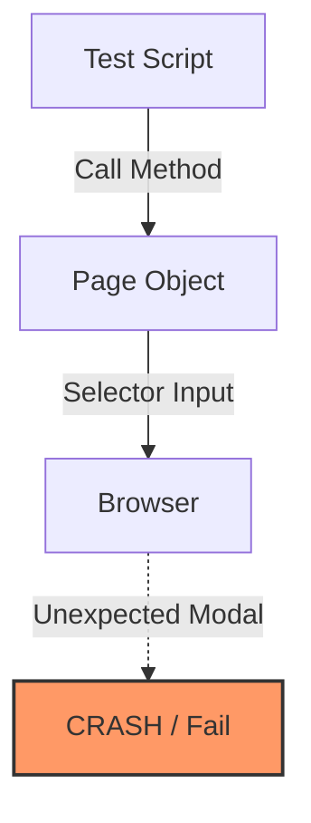
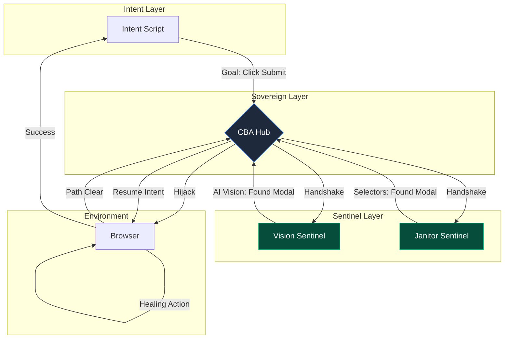

# CBA vs Traditional POM: Architectural Shift

This document outlines the fundamental shift from the linear **Page Object Model (POM)** to the non-linear, agentic **Constellation-Based Automation (CBA)**.

## 1. Traditional Page Object Model (POM)
In POM, the test script is tightly coupled to the UI structure through Page Objects. If an unexpected modal or UI change occurs, the test usually fails because the Page Object doesn't "know" how to handle the noise.



**Key Weakness:** The test logic must account for every possible UI state (modals, banners, loading states), leading to complex "if-else" logic in Page Objects.

---

## 2. Constellation-Based Automation (CBA)
CBA decouples **Intent** from **Environment**. The test only expresses a goal. A "Sentries" (Sentinels) monitor the environment and autonomously "heal" it before the intent is executed.



## Key Differences

| **Parameter** | **Page Object Model (POM)** | **CBA (The Sovereign Era)** |
| :--- | :--- | :--- |
| **Logic Type** | Linear / Procedural | Agentic / Goal-Oriented |
| **Healing** | Manual retry (Brittle) | **Predictive Memory** (Phase 7) |
| **Performance** | Hard-coded waits | **Temporal Pulse** (Phase 3) |
| **ROI** | Invisible (Maintenance Debt) | **Quantified Dashboard** (Phase 7) |
| **Outcome** | "Flaky" on chaotic sites | "Stable" via Sovereign Remediation |

---

## 3. The "Omega" Evolution: High-Fidelity Triage
Phase 6 introduces the ability to inspect the **Shared Intelligence** of the constellation at a microscopic level.

### Mission Tracing & Time-Travel
Unlike logs that only show errors, CBA's **Time-Travel Triage** records the entire life-cycle of the environmental handshake.

- **State Capture**: On every `starlight.intent`, the Hub performs a full B64 DOM dump.
- **Trace Serialization**: All JSON-RPC messages are timestamped and saved to `mission_trace.json`.
- **Environmental Playback**: The `triage.html` tool reconstructs the browser state for visual debugging.

### The OMEGA Handshake State Machine
The technical protocol follows a strict request-response cycle to ensure consensus:
1. `PRE_CHECK` (Hub) -> Broadcast to all prioritized Sentinels.
2. `REVIEW` (Sentinel) -> Analysis (Heuristic or Visual).
3. `VETO / CLEAR / HIJACK` (Sentinel) -> Hub evaluates priorities.
4. `EXECUTE / RETRY` (Hub) -> Safe action performed.

## 4. Phase 7: The Galaxy Mesh (Predictive Memory)
CBA now implements **long-term semantic persistence**.

### Historical Learning Engine
The Hub performs "Learning-at-Rest" by parsing `mission_trace.json` on startup:
```javascript
trace.forEach(event => {
    if (event.method === 'starlight.intent' && event.params.goal && event.params.selector) {
        this.historicalMemory.set(event.params.goal, event.params.selector);
    }
});
```
This builds a **Predictive Map** that bridges the gap between high-level intent and low-level DOM implementation.

### Self-Healing Retry Loop
When `executeCommand` encounters a `Playwright` exception, it triggers the healing loop:
1. Check if the current command has an associated `goal`.
2. Lookup `goal` in `historicalMemory`.
3. If a substitute selector exists, swap the selector and perform an immediate **Healing Retry**.

### Business Value Quantization
ROI is no longer subjective. The Hub uses a **Remediation value model**:
- **Sentinel Remediation**: $V = 5min + T_{duration}$ (Baseline triage time saved).
- **Predictive Healing**: $V = 2-3min$ (Avoided manual debugging and selector correction).
All metrics are summed into `totalSavedTime` and serialized to the HERO report.

---

## Summary: The "Hero's Journey"
In CBA, the **Intent Layer** is the "Hero" who wants to reach a destination. The **Sentinels** are the "Guardians" who clear the path. The **Hub** is the "Map" that coordinates the journey. The Hero never has to worry about the obstacles—they are handled by the Guardians before the Hero even takes a step.
