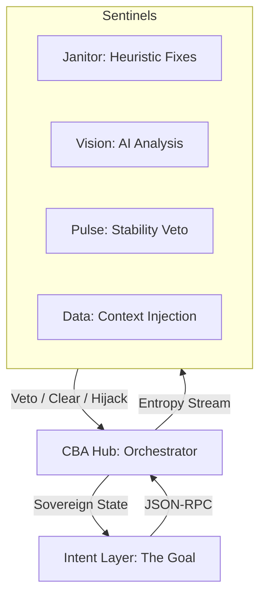

# 🌌 Starlight Protocol: The GALAXY User Guide

Welcome to the future of browser automation. This guide explains **Constellation-Based Automation (CBA)**—a paradigm shift from traditional Page Object Models (POM) and flaky `wait_for` calls toward a sovereign, multi-agent ecosystem.

---

## 1. The Core Philosophy: Why CBA?

Traditional automation is **brittle** because it couples the "Goal" (What you want) with the "Environment" (The chaos of the site). When a popup appears or the network lags, your script dies.

**CBA decouples them:**
- **The Intent Layer**: Only cares about the goal (e.g., "Login").
- **The Sentinels**: Guardians that watch the environment 24/7 and clear obstacles *before* they block the intent.
- **The Hub**: The "Air Traffic Controller" that orchestrates the two.

---

## 2. Architecture Overview



---

## 3. Basic Usage: The Mission

To run a CBA mission, you launch a **Constellation**.

1. **Launch the Hub**: `node src/hub.js`
2. **Launch Sentinels**: Run your agents (e.g., `python sentinels/pulse_sentinel.py`).
3. **Execute Intent**: `node src/intent.js`

> [!TIP]
> Use the provided `run_cba.bat` to launch the full world-class constellation at once!

---

## 4. Semantic Intent (Phase 5)

You no longer need to find selectors. Just tell the Hub what you want to achieve.

```javascript
// Old Way (Procedural)
await page.click('#submit-12345');

// CBA Way (Semantic)
await this.send({ goal: 'INITIATE MISSION' });
```
The Hub's **Semantic Resolver** will scan the page's accessibility layer and text content to find the correct element for you.

---

## 5. Temporal Stability (Phase 3)

Forget `setTimeout` or `waitForSelector`. The **Pulse Sentinel** monitors the environment's "Entropy" (network requests + DOM mutations).

- If the page is jittery, the Hub will automatically **WAIT**.
- Once the Pulse reports "Settled," the Hub executes.
- This results in **0-wait** code that is perfectly timed to the site's performance.

---

## 6. Understanding the Sentinels

### 💓 The Pulse Sentinel (Stability)
The Guardian of Time. It eliminates flakiness by ensuring the environment is stable before any action.

### 🧹 The Janitor Sentinel (Heuristics)
Detects known obstacles (modals, cookie banners) and hijacks control to clear them.

### 👁️ The Vision Sentinel (AI-Driven)
Uses Local AI (Ollama) to visually detect obstacles without selectors. Perfect for chaotic or encrypted UIs.

### 📊 The Data Sentinel (Intelligence)
Passively extracts metadata (tokens, IDs) and injects it into the shared context for your intent script to use.

---

## 7. OMEGA Standard: Time-Travel Triage (Phase 6)
CBA now features **Time-Travel Triage**, allowing you to inspect missions with surgical precision.

### How to use the Triage Tool
1.  **Run Mission**: Execute your mission as usual. A `mission_trace.json` file will automatically be generated in the root directory.
2.  **Open Triage**: Open [triage.html](file:///c:/cba/triage.html) in any modern browser.
3.  **Load Trace**: Click "Load mission_trace.json" and select your file.
4.  **Rewind**: Select any `starlight.intent` event to see exactly what the browser looked like at that moment.

### Why use Triage?
- **Debug "Black Box" Failures**: See why a goal failed by viewing the exact DOM state during execution.
- **Audit Sentinels**: Verify that Sentinels are identifying obstacles correctly.
- **Protocol Analysis**: Inspect the JSON-RPC timing and parameters.

---

## 8. Cloud Orchestration (Docker)
CBA is ready for ephemeral, cloud-based execution via Docker.

### Running via Docker Compose
Simply run:
```bash
docker-compose up --build
```
This will spin up:
- **Hub**: The central orchestrator.
- **Sentinels**: A managed mesh of Pulse, Janitor, and Data agents.

### Benefits
- **Ephemeral Environments**: Perfect for CI/CD pipelines.
- **Isolation**: Each mission runs in a clean, containerized browser context.
- **Standardization**: Identical execution across all environments.

---

## 9. Phase 7: Predictive Intelligence & The Galaxy Mesh
CBA is no longer just a listener; it is a **learner**.

### 🧬 Self-Healing Selectors
When a UI change breaks a selector, the Hub switches from **Reactive** to **Predictive** mode:
1.  **Failure Detected**: A command fails to find its target.
2.  **Memory Retrieval**: The Hub consults its `historicalMemory` (learned from past successful `mission_trace.json` runs).
3.  **Substitution**: It automatically retries with a historically successful selector for that specific goal.
4.  **Proof**: The event is tagged with a **SELF-HEALED** badge in the report.

### 💰 Interpreting the ROI Dashboard
The Hero Story (`report.html`) now quantifies the "Autonomy ROI":
- **Minutes Saved**: The Hub calculates value based on:
    - **5 mins** baseline for every Sentinel intervention (manual triage avoidance).
    - **2-3 mins** for every Self-Healing event (manual debugging avoidance).
- **Visual Validation**: "Before" and "After" snapshots provide evidence of exactly where the Hub saved the mission.

---

## 7. Troubleshooting

- **AI Analysis Timed Out**: Ensure [Ollama](https://ollama.ai/) is running with the `moondream` model.
- **Goal Resolution Failed**: Ensure the button or link has visible text or aria-labels that match your goal.
- **System Unresponsive**: View the `CBA Hub` console for "Critical Sentinel UNRESPONSIVE" errors.

---

🌠 *The stars in the constellation are many, but the intent is one.*
